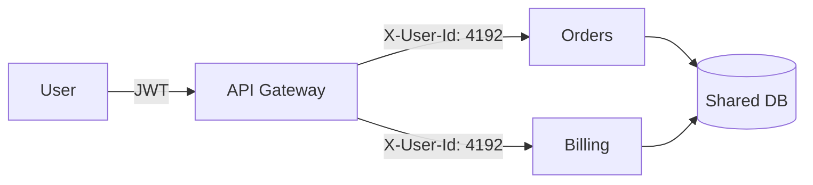
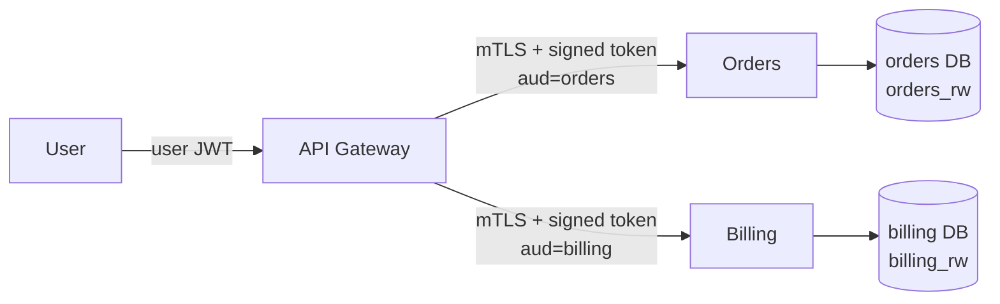
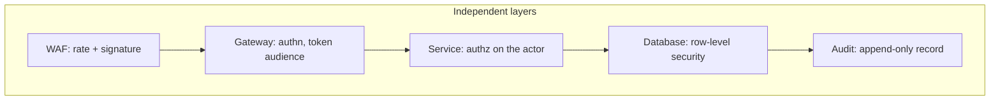
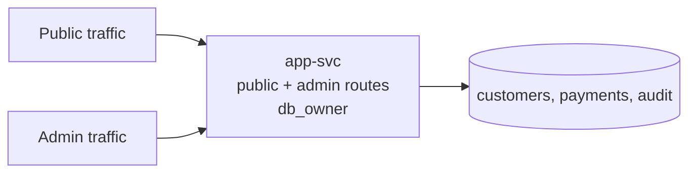
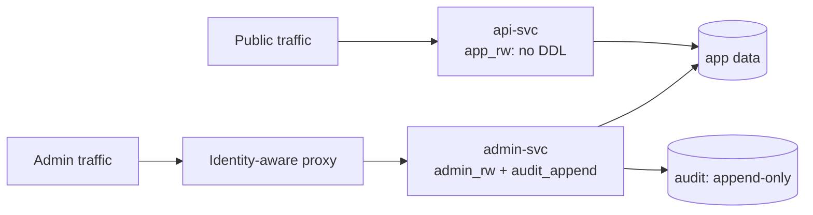
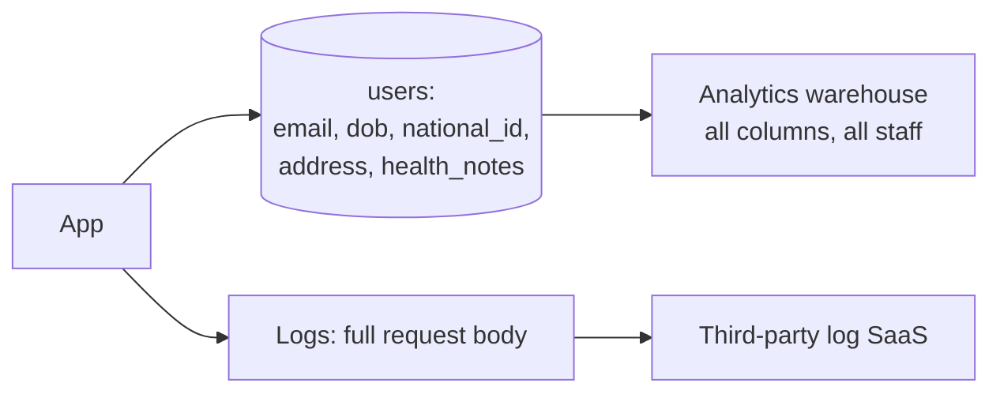
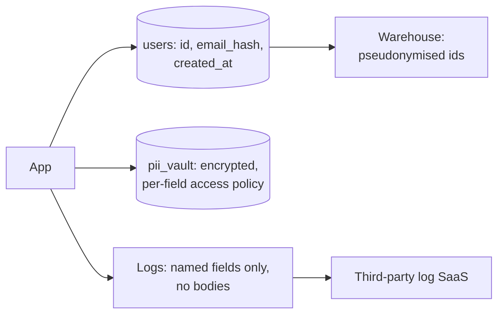

# Architecture Patterns That Hold Up

Each pattern names its Top 10 category, ASVS chapter, and CWE. Each shows a vulnerable design and
a fixed one, because an architecture diagram with no failure written on it is a wish list.

## Trust Boundaries

`A01:2025` · ASVS V8 · `CWE-668`

A trust boundary is where two components trust each other differently. The failure is not "we
forgot a boundary" — it is that a boundary exists in the deployment topology and nothing enforces
it, so the whole interior becomes one privilege level.

Vulnerable: the gateway authenticates, then everything behind it trusts a header.



Anything that can reach `ORD` on the pod network sets `X-User-Id` to any value. A misconfigured
service, a compromised sidecar, or an SSRF in a third service becomes full impersonation, because
the header is a claim with no proof attached.

Fixed: the principal travels as a verifiable token, and each service verifies it.



```python
# Vulnerable: identity is whatever the caller wrote in the header
def current_actor(request) -> Actor:
    return Actor(id=int(request.headers["X-User-Id"]))

# Fixed: identity is whatever survives signature verification
def current_actor(request) -> Actor:
    token = request.headers.get("Authorization", "").removeprefix("Bearer ").strip()
    if not token:
        raise Unauthenticated()
    claims = jwt.decode(
        token,
        key=INTERNAL_JWKS.key_for(token),
        algorithms=["RS256"],
        issuer="https://gateway.internal.example.com",
        audience="orders",              # this service, not "internal"
    )
    return Actor(id=int(claims["sub"]), tenant=claims["tenant"])
```

Why it works: the claim is now bound to a signature the caller cannot produce and to an audience
that stops a token minted for `billing` being replayed at `orders`. Network position proves
nothing, which is NIST SP 800-207 tenet 2.

The tempting wrong fix is a shared secret header — `X-Internal-Key`. It proves the caller is
inside the perimeter, which is exactly the property you should stop trusting. It carries no
principal, so `orders` still cannot tell user 4192 from user 4193.

## Zero Trust, Concretely

`A01:2025` · ASVS V8

Zero trust is four decisions, not a product:

| Decision | Concretely |
|---|---|
| Every resource request is authenticated | mTLS between services plus a per-request principal |
| Per-session, least-privilege grant | Token audience is one service, scope is one operation, TTL is minutes |
| Policy is dynamic | Device posture, tenant, and time factor into the decision, not just the role |
| Nothing is trusted by location | The pod network is treated as hostile |

NIST SP 800-207 puts the enforcement point as close to the resource as the design allows, because
"the implicit trust zone must be as small as possible." A gateway is a large implicit trust zone:
everything behind it shares one trust level. Authorization next to the data shrinks it to one
process.

What zero trust does not mean: no network controls. Segmentation still reduces blast radius. It
means segmentation stops being the thing that grants access.

## Authorization Placement

`A01:2025` · ASVS V8 · `CWE-1220`

The rule: the component that holds the row decides who reads it. Anything upstream is defence in
depth.

Vulnerable: authorization lives in the gateway's route table.

```yaml
# Vulnerable: the only check is a path prefix and a role claim
routes:
  - path: /admin/*
    require_role: admin
    upstream: http://admin-svc
  - path: /api/*
    require_auth: true
    upstream: http://app-svc
```

Two holes. `app-svc` is reachable directly from inside the cluster, and any authenticated user
hitting `/api/orders/4192` gets a response because `app-svc` never checks ownership. The gateway
answered "is this a user", which is not the question.

Fixed: the data layer enforces, the gateway is one more layer.

```python
# Fixed: the repository cannot be called without an actor
class OrderRepository:
    def get(self, order_id: str, actor: Actor) -> Order | None:
        return (
            self.session.query(Order)
            .filter(
                Order.id == order_id,
                Order.tenant_id == actor.tenant,   # from the token
                Order.customer_id == actor.id,
            )
            .one_or_none()
        )
```

Why it works: there is no call signature that omits the actor, so a new caller cannot forget the
check. Reviewers see a missing argument, which is a compile or test failure, rather than a missing
`if`, which is invisible.

## Tenant Isolation

`A01:2025` · ASVS V8 · `CWE-653`

Ranked by how hard they are to get wrong, weakest first:

| Model | Isolation | Cross-tenant leak needs |
|---|---|---|
| Shared table, app-level filter | Weakest | One forgotten `WHERE` |
| Shared table, database row-level security | Medium | A connection that forgets to set the tenant, or a superuser role |
| Schema or database per tenant | Strong | A wrong connection string |
| Cluster or account per tenant | Strongest | An IAM mistake |

Pick by consequence, not by tenant count. A shared table with app-level filtering is defensible
for internal tooling and indefensible for regulated customer data.

The failure everyone hits with shared tables: the request path gets the filter right and something
else does not. Reports, exports, background jobs, admin tooling, search reindexing, the cache. See
[examples/tenant-isolation.sql](examples/tenant-isolation.sql) for row-level security with the
`FORCE` and `BYPASSRLS` details that decide whether it actually holds.

Scope every derived store too. A cache key of `user:4192:profile` with no tenant prefix collides
across tenants the moment IDs are per-tenant sequences.

## Least Privilege

`A01:2025` · ASVS V8 · `CWE-250`

Scope to the operation and the resource, not to the service.

```hcl
# Vulnerable: "the service needs S3" becomes "the service owns S3"
statement {
  actions   = ["s3:*"]
  resources = ["*"]
}
```

That grants `s3:DeleteBucket` on every bucket in the account, including the audit log bucket and
the Terraform state bucket. The blast radius of an SSRF in this service is now the whole account's
object storage.

```hcl
# Fixed: one verb set, one prefix, with a condition
statement {
  actions   = ["s3:GetObject", "s3:PutObject"]
  resources = ["arn:aws:s3:::acme-uploads-prod/tenants/*"]
  condition {
    test     = "StringEquals"
    variable = "s3:x-amz-server-side-encryption"
    values   = ["aws:kms"]
  }
}
```

Why it works: the grant now matches an operation the code actually performs. Deletion, listing
other buckets, and unencrypted writes are not merely discouraged, they are unavailable.

Full worked example, including the OIDC trust policy that replaces a long-lived key, in
[examples/iam-least-privilege.tf](examples/iam-least-privilege.tf).

Three identities people forget to scope: the CI role that deploys, the migration user that has DDL
in production because it was easier, and the read replica connection that is a superuser because
the ORM asked for one.

## Secure Defaults

`A02:2025` · ASVS V13 · `CWE-1188`

Absent configuration must deny. This is the difference between a control and a suggestion.

```go
// Vulnerable: unset means permissive, and the operator never knows
func LoadPolicy() Policy {
    return Policy{
        RequireMFA:     os.Getenv("REQUIRE_MFA") == "true",   // unset -> false
        AllowedOrigins: strings.Split(os.Getenv("CORS_ORIGINS"), ","), // unset -> [""]
        PublicByDefault: true,
    }
}
```

A typo in the environment variable name silently disables MFA. There is no signal at startup, and
the tests pass because the test environment sets it correctly.

```go
// Fixed: secure default, explicit opt-out, fail to start on a missing required value
func LoadPolicy() (Policy, error) {
    p := Policy{RequireMFA: true, PublicByDefault: false}

    if v, ok := os.LookupEnv("INSECURE_DISABLE_MFA"); ok && v == "true" {
        log.Warn("mfa_disabled_by_configuration")   // loud, and greppable in prod logs
        p.RequireMFA = false
    }

    origins, ok := os.LookupEnv("CORS_ORIGINS")
    if !ok || strings.TrimSpace(origins) == "" {
        return Policy{}, errors.New("CORS_ORIGINS is required")   // no silent wildcard
    }
    p.AllowedOrigins = strings.Split(origins, ",")

    return p, nil
}
```

Why it works: three properties. The default is the safe value, the unsafe path is named so it
cannot be enabled by accident, and a missing required value stops the process instead of producing
a permissive default. A crash at deploy is cheap; a silently open CORS policy is not.

More patterns in [examples/secure-defaults.yaml](examples/secure-defaults.yaml).

## Defence in Depth, Honestly

`A06:2025` · ASVS V15

Layers help only when they fail independently. Two checks reading the same client-supplied header
are one check.



Each layer here fails for a different reason: WAF on traffic shape, gateway on signature, service
on business rule, database on session variable, audit on write path. A bypass of one does not
imply a bypass of the next.

The anti-pattern is stacking correlated layers and counting them. "We have a WAF, so SQL injection
is handled" is one layer, and it is the layer with the highest false-negative rate.

## Failure Modes and Resilience

`A06:2025`, `A10:2025` · ASVS V16

Write the table. Per dependency: what breaks, what the caller sees, whether security degrades.

| Dependency | Down | Caller sees | Security |
|---|---|---|---|
| Auth provider | New logins fail | 503 | Existing sessions continue to expiry; no new grants |
| Policy service | Authorization undecidable | 503 | Deny. Never cached-allow past TTL |
| Audit sink | Writes cannot be recorded | 503 on mutations | Reject the mutation, or buffer durably and alert |
| Rate limiter | Counters unavailable | 429 or degraded | Fail closed to a conservative local limit |
| Feature flag service | Flags unresolvable | Normal | Fall back to the flag's safe default, not last-seen |

The dangerous cell is the audit row. Choosing "log locally and continue" is legitimate if the local
buffer is durable and alerted on. Choosing "continue silently" turns a sink outage into an
unrecorded window that an attacker can cause on purpose.

```python
# Vulnerable: cached allow outlives the outage
def can_approve(actor, request_id) -> bool:
    try:
        return policy.check(actor, request_id, "approve")
    except PolicyUnavailable:
        return cache.get_last_known(actor, "approve", default=True)

# Fixed: bounded cache, deny past the bound, and the failure is visible
def can_approve(actor, request_id) -> bool:
    try:
        decision = policy.check(actor, request_id, "approve")
        cache.set(actor, "approve", decision, ttl=60)
        return decision
    except PolicyUnavailable:
        cached = cache.get_fresh(actor, "approve", max_age=60)
        if cached is None:
            log.error("policy_unavailable_deny", extra={"actor": actor.id})
            raise ServiceUnavailable("authorization_unavailable")
        return cached
```

Why it works: a short cache absorbs a blip without turning an outage into a permanent grant. The
bound is what makes it safe — an unbounded "last known" value means an attacker who can keep the
policy service down keeps their access forever.

Bulkheads matter here too. A shared connection pool means one slow tenant's queries exhaust the
pool and every tenant sees timeouts. Partition the pool per tenant class, or per criticality, so
saturation is contained.

## Abuse Cases

`A06:2025`

Use cases describe a cooperative user. Abuse cases start from the attacker's goal and work
backwards. Write them in the same document as the requirements — a separate security document does
not get read.

| Feature | Use case | Abuse case | Control |
|---|---|---|---|
| Password reset | User regains access | Enumerate accounts; flood a victim's inbox | Uniform response, per-email and per-IP limit |
| CSV export | User downloads their data | Export the whole table via a tampered filter | Server-side tenant scope; row cap; async with audit |
| Invite teammate | Team grows | Invite self to another tenant; escalate own role | Inviter's role bounds the invited role |
| Webhook config | Notify the customer's system | Point it at `169.254.169.254` or an internal admin URL | Egress allowlist, resolve-and-check, no redirects |
| Image resize | Thumbnails | Upload a decompression bomb; burn CPU per request | Dimension and pixel caps, per-actor quota, isolated worker |
| Free trial | Try the product | Farm trials for compute | Identity friction, per-payment-instrument limit |

The insider abuse case is the one that gets skipped. Ask what a support agent can read, whether
they need it, and whether it is recorded. "Support can view any account to help customers" is a
design decision that needs an ADR and an audit trail, not a default.

## Service Boundaries

`A01:2025` · ASVS V15 · `CWE-653`

Split by trust level and blast radius. Splitting by team produces services that all hold the same
data with the same credentials, which is a distributed monolith with more attack surface.

Vulnerable: one service, one credential, both surfaces.



An authorization bug in a public route reaches admin functionality in the same process, with a
credential that can drop tables and rewrite audit rows.

Fixed: separate deployment, separate credential, separate network reachability.



Why it works: reaching admin functionality now needs a second authentication at the proxy and
network reachability the public path does not have. The public credential cannot perform admin
writes even if the process is fully compromised.

Two more boundary rules:

- No shared write path to one table as an implicit interface. It is an API with no schema, no
  versioning, and no authorization. Publish an event or call an endpoint.
- Restrict egress. A service that only talks to its database and one internal peer should not be
  able to dial the internet. This is what turns an RCE into a contained incident.

## Privacy by Design

`A02:2025` · ASVS V14 · `CWE-359`

Threat model privacy separately. LINDDUN's categories catch what STRIDE does not: linking,
identifying, non-repudiation, detecting, data disclosure, unawareness, non-compliance.

Vulnerable: everything about a user in one row, replicated everywhere by default.



The design has no way to answer "who can read national IDs", and a support engineer debugging in
the log tool sees more than the database's access rules allow.

Fixed: separate by sensitivity, minimise at the boundary, and make deletion tractable.



Why it works: three properties the first design cannot offer. The warehouse and the log tool never
receive direct identifiers, so a compromise there is not a PII breach. Access to the vault is a
separate decision from access to the app database. Deletion is one place plus a hash rotation,
instead of a search across every downstream copy.

Rules that follow:

- Collect the field only if a named feature needs it. "It might be useful" is not a purpose.
- Set retention at design time, per store, and enforce it with a job that runs.
- Deletion covers backups, caches, search indexes, and downstream copies. If it cannot, document
  what survives and for how long.
- Do not let personal data enter logs, analytics, or error reports by default. Mask on the way in.

## Security ADRs

`A06:2025` · SSDF PO.1

Write one when a security-relevant tradeoff is made, a control is rejected, or a risk is accepted.
Short is fine. Undated and unowned is not.

```markdown
# ADR-014: Shared database with row-level security for tenant isolation

Status: Accepted
Date: 2026-07-28
Owner: platform-team
Deciders: platform-team, security

## Context
Multi-tenant SaaS, 400 tenants, largest holds 2M rows. Tenant data is commercial,
not regulated health or payment data.

## Threat
A missing tenant predicate in any query path leaks one tenant's rows to another.
Assumed attacker: an authenticated user of tenant A with no special access.

## Options
1. Database per tenant — strongest isolation, migration cost scales with tenant count.
2. Shared tables, application-level filtering — cheapest, one forgotten WHERE leaks data.
3. Shared tables, PostgreSQL RLS with FORCE — one enforcement point, needs a non-superuser
   application role and a per-connection tenant setting.

## Decision
Option 3. RLS with FORCE ROW LEVEL SECURITY, application role without BYPASSRLS, tenant set
from the verified token in a connection-scoped setting.

## Consequences
- A forgotten predicate now fails closed: zero rows, not another tenant's rows.
- Any future superuser or BYPASSRLS connection silently defeats this. Enforced by a CI check
  that asserts the application role lacks BYPASSRLS.
- Analytics reads go through the same role, which costs some query flexibility.

## Residual risk
A logic bug that sets the wrong tenant on the connection still leaks. Accepted, mitigated by
an integration test per endpoint that asserts cross-tenant reads return empty.

## Review
Revisit if a regulated-data tenant is signed, or above 2000 tenants.
```

Why this shape works: the threat is stated so a later reader can tell whether it changed, the
rejected options are recorded so they are not re-proposed as novel, and the residual risk has a
named owner and a trigger for review. An ADR without a residual risk section is usually hiding one.

## Review Gates

`A06:2025` · SSDF PO, PW

Gate on design, not only on diff. Three gates, each with an explicit trigger:

| Gate | Trigger | Blocks on |
|---|---|---|
| Design review | New service, new trust boundary, new data class, new third party | Boundary table missing; no failure-mode table |
| Threat model | Any of the above, plus auth or payment changes | No abuse cases; no answer to "what can go wrong" per crossing |
| Pre-production | First deploy handling real data | Unresolved Critical or High; no audit trail; no ADR for accepted risk |

Keep gates cheap enough to survive. A design review that takes three weeks gets routed around, in
the same way a noisy CI gate gets disabled. Thirty minutes with the boundary table and the failure
table catches most of what matters.

## Sources

- <https://owasp.org/Top10/2025/>
- <https://owasp.org/www-project-application-security-verification-standard/>
- <https://csrc.nist.gov/pubs/sp/800/207/final>
- <https://csrc.nist.gov/pubs/sp/800/218/final>
- <https://cheatsheetseries.owasp.org/cheatsheets/Threat_Modeling_Cheat_Sheet.html>
- <https://linddun.org/>
- <https://cwe.mitre.org/>
