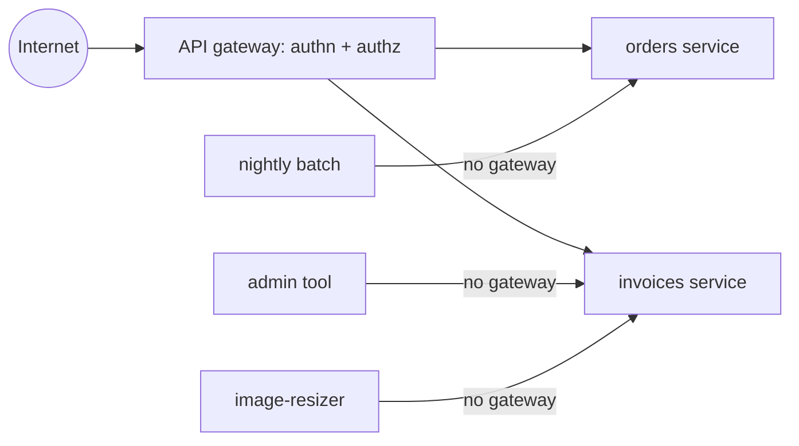
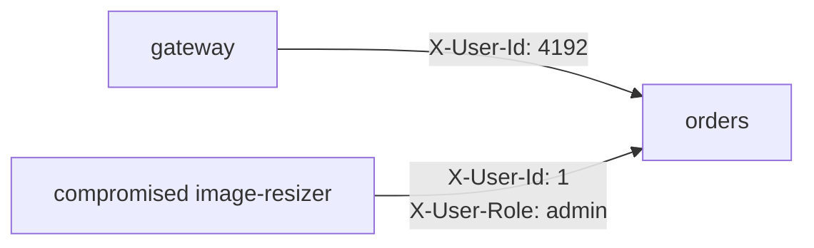
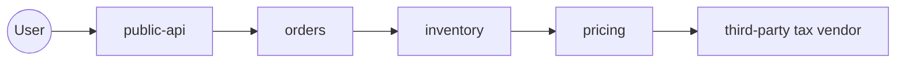

# Secure Architecture Examples

Seven design flaws, each with the failure first and the redesign second. These are architectural:
in every case, fixing the symptom in one file leaves the same problem reachable by another path.

Read them as designs. The syntax is incidental. Every fix ends with the gap it does not close -
a design that claims to close everything has not been thought about.

## Contents

- [Authorization only at the gateway](#authorization-only-at-the-gateway) - A01, CWE-602
- [An internal service trusts a caller-supplied user ID](#an-internal-service-trusts-a-caller-supplied-user-id) - A01, CWE-290
- [One database role, every service's tables](#one-database-role-every-services-tables) - A01, CWE-1220
- [A shared secret passed down the call chain](#a-shared-secret-passed-down-the-call-chain) - A04, CWE-522
- [A synchronous chain with no timeout](#a-synchronous-chain-with-no-timeout) - A10, CWE-770
- [An event consumer that trusts the payload](#an-event-consumer-that-trusts-the-payload) - A01, CWE-863
- [A "private" service reachable from the internet](#a-private-service-reachable-from-the-internet) - A02, CWE-1327

---

## Authorization only at the gateway

`A01:2025` · `CWE-602` · ASVS V8

The gateway checks the token and the tenant. The services behind it check nothing, because "you
cannot get here without going through the gateway".



```yaml
# Vulnerable: the only authorization decision in the system
routes:
  - match: { prefix: /api/invoices }
    plugins:
      - jwt: { issuer: https://auth.example.com }
      - opa: { policy: tenant_membership }
    upstream: invoices.internal:8080
```

```python
# Vulnerable: the service that holds the data has no opinion about who is asking
@app.get("/invoices/{invoice_id}")
def get_invoice(invoice_id: str):
    return db.execute(
        "SELECT * FROM invoices WHERE id = %s", (invoice_id,)
    ).one_or_none()
```

Three paths already skip the check in the diagram, and none of them looks like an attack: a batch
job, an admin tool, and an unrelated service that processes uploads. The gateway is a policy
enforcement point placed far from the resource, so everything behind it is one implicit trust zone
(NIST SP 800-207 §2.1). The finding is not that a check is wrong. It is that the check is in a
component a caller can decline to use.

```python
# Fixed: the service holding the row decides, and the decision is one choke point
class Principal(NamedTuple):
    subject: str
    tenant: str

def principal(request) -> Principal:            # raises on missing/invalid token
    claims = verify_service_token(request, audience="invoices")
    return Principal(subject=claims["sub"], tenant=claims["tenant"])

def invoice_for(actor: Principal, invoice_id: str):
    return db.execute(
        "SELECT * FROM invoices WHERE id = %s AND tenant_id = %s",
        (invoice_id, actor.tenant),
    ).one_or_none()

@app.get("/invoices/{invoice_id}")
def get_invoice(invoice_id: str, actor: Principal = Depends(principal)):
    invoice = invoice_for(actor, invoice_id)
    if invoice is None:
        raise HTTPException(404)                # same answer for absent and not-yours
    return invoice
```

Why this removes the path rather than moving it: the batch job, the admin tool and the resizer now
have to present a token for audience `invoices`, and the tenant in that token scopes the query. The
gateway keeps its checks - as defence in depth, and because rate limiting and schema validation
belong at the edge - but it is no longer the only place a decision happens.

Residual gap: this depends entirely on `verify_service_token` being real (see the next example). It
also does nothing about a caller that reaches the database directly instead of the service; that is
the third example. And a service-issued token still carries whatever authority it was minted with,
so a compromised batch job acts as the batch job everywhere the batch job is allowed.

---

## An internal service trusts a caller-supplied user ID

`A01:2025` · `CWE-290` · ASVS V4, V8

```python
# Vulnerable: the principal is whatever the caller typed into a header
def current_user(request):
    return User(
        id=request.headers["X-User-Id"],
        tenant=request.headers["X-Tenant-Id"],
        role=request.headers.get("X-User-Role", "member"),
    )
```



The header is set by the gateway on the legitimate path, which is why it looks safe. It is also
settable by anything else that can open a TCP connection to port 8080. One deserialization bug in a
pod that processes uploads and the attacker is every user, including the admin, with no credential
theft involved. Authentication is being asserted rather than verified - CWE-290.

The fix is a verified token plus a header the edge strips unconditionally:

```python
# Fixed: identity comes from a signature the caller cannot forge
def current_user(request) -> User:
    token = request.headers.get("Authorization", "").removeprefix("Bearer ").strip()
    claims = jwt.decode(
        token,
        key=jwks.for_unverified_kid(token),
        algorithms=["RS256"],                    # server states the algorithm
        issuer="https://auth.example.com",
        audience="orders",                       # a token minted for payments fails here
        options={"require": ["exp", "sub", "aud", "iss"]},
    )
    return User(id=claims["sub"], tenant=claims["tenant"], role=claims["role"])
```

```yaml
# Fixed: the edge removes the legacy headers so a stale reader cannot be reached
request_headers_to_remove: [x-user-id, x-tenant-id, x-user-role]
```

Why this removes the path: forging identity now requires the issuer's signing key rather than a
`curl -H`. Pinning `audience` matters as much as the signature - without it, a token valid for any
service in the estate is valid for this one, and per-service identity collapses back into a single
trust zone.

Do not do the tempting middle version: HMAC the headers with a shared secret. That authenticates the
gateway, not the user, so any service holding the secret can still mint any user.

Residual gap: a stolen token works until it expires, and a self-contained token cannot be revoked
mid-life - keep lifetimes short and re-check high-value operations against the source of truth. Where
mTLS terminates in a sidecar, every container in that pod inherits the workload identity. Network
policy still matters, because reaching the port at all should not be free
([service-authz.yaml](service-authz.yaml)).

---

## One database role, every service's tables

`A01:2025` · `CWE-1220` · ASVS V8, V15

```sql
-- Vulnerable: one role, every table, because it was easier during the split
CREATE ROLE app_user LOGIN PASSWORD 'placeholder';
GRANT ALL PRIVILEGES ON ALL TABLES IN SCHEMA public TO app_user;
```

```yaml
# Vulnerable: the same connection string in three deployments
env:
  - name: DATABASE_URL
    valueFrom: { secretKeyRef: { name: db, key: url } }   # shipping, orders, and billing
```

The services were separated. The failure domain was not. A compromise of the shipping service - the
one with the most third-party code and the least attention - reads `billing.payment_methods` and
writes `orders.orders`, because the credential it holds is the credential everything holds. This is
also how a "microservices migration" ends up with a larger blast radius than the monolith it
replaced: same grants, more processes holding them.

```sql
-- Fixed: a schema and a role per service, grants scoped to what the service owns
CREATE SCHEMA billing;
CREATE SCHEMA shipping;

REVOKE ALL ON SCHEMA public FROM PUBLIC;

CREATE ROLE billing_svc LOGIN PASSWORD :'billing_pw';
GRANT USAGE ON SCHEMA billing TO billing_svc;
GRANT SELECT, INSERT, UPDATE ON ALL TABLES IN SCHEMA billing TO billing_svc;
ALTER DEFAULT PRIVILEGES IN SCHEMA billing
  GRANT SELECT, INSERT, UPDATE ON TABLES TO billing_svc;   -- covers future tables

CREATE ROLE shipping_svc LOGIN PASSWORD :'shipping_pw';
GRANT USAGE ON SCHEMA shipping TO shipping_svc;
GRANT SELECT, INSERT, UPDATE ON ALL TABLES IN SCHEMA shipping TO shipping_svc;

-- No DELETE, no DDL at runtime. Migrations use a separate role, in a separate job.
CREATE ROLE migrator LOGIN PASSWORD :'migrator_pw';
GRANT ALL ON SCHEMA billing, shipping TO migrator;
```

Where shipping genuinely needs a billing fact, it calls the billing service and gets the fields the
API chooses to return. The cross-schema `SELECT` that "is only for a dashboard" is the thing being
removed, because it is an interface nobody versions and everybody depends on.

Why this removes the path: the grant no longer exists. A missing grant is a hard failure at the
database, not a convention someone can forget - the same reason row-level security beats a repository
base class ([tenant-isolation.sql](tenant-isolation.sql)).

Residual gap: one instance is still one availability domain, and a leaked superuser or a Postgres
privilege-escalation bug reaches everything regardless of grants. `ALTER DEFAULT PRIVILEGES` only
applies to tables created by the role that ran it, so a new table created by a different migrator
identity silently has no grants - that surfaces as a runtime error, which is the safe direction but
still an outage.

---

## A shared secret passed down the call chain

`A04:2025` · `CWE-522` · ASVS V8, V9, V11

```python
# Vulnerable: one static secret proves "I am internal", and the user's token is forwarded on
INTERNAL_KEY = os.environ["INTERNAL_API_KEY"]      # identical in all 14 services

def reserve_stock(order, user_token):
    return httpx.post(
        "https://inventory.internal/reserve",
        json={"sku": order.sku, "qty": order.qty},
        headers={
            "X-Internal-Key": INTERNAL_KEY,        # authenticates the estate, not the caller
            "Authorization": f"Bearer {user_token}",  # passthrough to an unintended audience
        },
    )
```

Two problems, both structural. The shared key means every service can impersonate every other
service, so compromising the least important one grants the authority of the most important one; it
also cannot be rotated without a coordinated deploy, which is why it never is. The forwarded user
token means the inventory service receives a credential minted for a different audience, and now
holds something it can replay against everything else that accepts it.

```python
# Fixed: the caller proves its own identity; the user's authority is exchanged, not forwarded
def reserve_stock(order, user_token: str):
    downstream = token_exchange(                    # RFC 8693 style exchange
        subject_token=user_token,
        audience="inventory",                       # scoped to one callee
        scope="stock:reserve",                      # scoped to one operation
    )
    return httpx.post(
        "https://inventory.internal/reserve",
        json={"sku": order.sku, "qty": order.qty},
        headers={"Authorization": f"Bearer {downstream.access_token}"},
        cert=WORKLOAD_CERT,                         # mTLS: caller identity from the platform
        timeout=httpx.Timeout(2.0, connect=0.5),
    )
```

The workload certificate comes from the platform - SPIFFE/SPIRE, a mesh, or the cloud's instance
identity - so no service holds a long-lived secret that identifies it. The same reasoning applies to
cloud credentials: a per-service role assumed at runtime rather than an access key in an environment
variable ([iam-least-privilege.tf](iam-least-privilege.tf)).

Why this removes the path: the exchanged token is bound to one audience and one scope, so stealing it
from the inventory service buys stock reservations for that user and nothing else. There is no longer
a single secret whose disclosure is estate-wide.

Residual gap: the token exchange is a new synchronous dependency on the authorization server, and its
outage behaviour has to be decided per operation - see the next example. The exchanged token is still
a bearer token: whoever holds it can use it, so lifetimes are minutes, not hours. And audience
validation only helps if every callee actually enforces it; one service that ignores `aud` re-opens
the replay path for everyone.

---

## A synchronous chain with no timeout

`A10:2025` · `CWE-770` · ASVS V15, V16



```python
# Vulnerable: no timeout, no bound on concurrency, unlimited retries
def get_tax(order):
    for attempt in range(5):                       # retry storm generator
        try:
            return requests.post(VENDOR_URL, json=order.as_dict()).json()
        except requests.RequestException:
            continue
```

The tax vendor gets slow - not down, slow. Every request in `pricing` holds a worker for 30 seconds,
`pricing`'s pool fills, `inventory` blocks, `orders` blocks, and the public API stops answering. One
third party's bad afternoon is a full outage, and the retries make it worse by multiplying load
against a service that is already struggling. Availability is a security property (STRIDE Denial of
Service, ASVS V15 on resource-demanding functionality), and outages are also when fail-open gets
introduced under pressure.

```python
# Fixed: a deadline for the request, a timeout per hop, bounded concurrency, a breaker
TAX_BREAKER = CircuitBreaker(failure_threshold=5, reset_timeout=30)
TAX_SLOTS = asyncio.Semaphore(20)                  # bulkhead: vendor cannot own every worker

async def get_tax(order, deadline: float) -> TaxResult:
    remaining = deadline - time.monotonic()
    if remaining <= 0.2:
        raise DeadlineExceeded("no budget left for tax lookup")

    async with TAX_SLOTS:
        try:
            with TAX_BREAKER:
                resp = await client.post(
                    VENDOR_URL,
                    json=order.as_dict(),
                    timeout=httpx.Timeout(min(remaining, 1.5), connect=0.3),
                )
            return TaxResult.parse(resp.json())
        except (BreakerOpen, httpx.HTTPError) as exc:
            raise TaxUnavailable() from exc         # explicit, typed, decided by the caller
```

```python
# The decision that matters is what the caller does with TaxUnavailable, per operation.
try:
    tax = await get_tax(order, deadline)
except TaxUnavailable:
    if order.is_quote:
        return quote_without_tax(order)            # degrade: display only, marked estimated
    raise ServiceUnavailable("tax_unavailable")     # money movement: fail closed, 503
```

Why this removes the path: a deadline budget means the total time a request can consume is bounded no
matter how many hops it has, the semaphore means one slow dependency cannot consume every worker, and
the breaker stops the retry amplification. The security content is in the last block: the answer to
"dependency unavailable" is written down per operation instead of being improvised.

Residual gap: timeouts bound time, not bytes - a slow, enormous response still needs a size limit.
Breaker thresholds are guesses until load-tested, and a breaker that opens on the authorization path
is exactly where someone will later add a permissive default. Retry budgets have to be global to
work; a per-call retry limit in five services still multiplies to 5^n at the leaf.

---

## An event consumer that trusts the payload

`A01:2025` · `CWE-863` · ASVS V8, V15

```python
# Vulnerable: the consumer applies whatever the event says, as whoever the event names
def on_message(msg):
    ev = json.loads(msg.value)
    if ev["type"] == "role_granted":
        db.execute(
            "UPDATE memberships SET role = %s WHERE user_id = %s AND tenant_id = %s",
            (ev["role"], ev["user_id"], ev["tenant_id"]),
        )
```

The producer checked authorization before publishing. The consumer did not, and the consumer is where
the privilege change actually lands. Anything that can write to the topic - a compromised producer, a
misconfigured test harness, a service with broad broker credentials, a replayed message - grants
itself `owner` in any tenant. The authorization decision was made in a different component from the
one performing the action, which is CWE-863 in the same shape as the gateway example, one transport
along.

```python
# Fixed: the event is a notification of a fact; authority is re-derived at the consumer
def on_message(msg):
    envelope = verify_envelope(msg)                  # producer identity + signature, fail closed
    ev = RoleGranted.model_validate_json(envelope.payload)   # schema, not dict access

    with db.transaction() as tx:
        if tx.seen(envelope.event_id):               # idempotency: replays are no-ops
            return

        grant = tx.one_or_none(
            """SELECT actor_id, target_user_id, tenant_id, role
                 FROM role_grant_requests
                WHERE id = %s AND status = 'approved'""",
            (ev.grant_request_id,),
        )
        if grant is None:
            raise RejectMessage("no approved grant for this event")

        if not authz.can_grant_role(actor=grant.actor_id, tenant=grant.tenant_id, role=grant.role):
            audit.log("role_grant_rejected", actor=grant.actor_id, tenant=grant.tenant_id)
            raise RejectMessage("actor not permitted to grant this role")

        tx.execute(
            "UPDATE memberships SET role = %s WHERE user_id = %s AND tenant_id = %s",
            (grant.role, grant.target_user_id, grant.tenant_id),
        )
        tx.record(envelope.event_id)
```

Why this removes the path: the event carries an ID, not an instruction. Everything that decides the
outcome - actor, tenant, role - is read from the consumer's own source of truth and re-authorized
locally, so a forged or replayed message cannot supply its own facts. The signature check means an
unknown producer cannot enqueue work at all, and the idempotency record means at-least-once delivery
does not become at-least-once privilege escalation.

Residual gap: re-reading the source of truth couples the consumer to a database it might rather not
call, and adds a dependency whose outage behaviour needs the treatment from the previous example.
Envelope signing needs key distribution and rotation. Broker topic ACLs are the boundary that keeps
strangers out, and they are runtime state - reading this code tells you nothing about whether they
are applied.

---

## A "private" service reachable from the internet

`A02:2025` · `CWE-1327` · ASVS V13

```yaml
# Vulnerable: "internal" admin API, exposed by a Service type nobody looked at twice
apiVersion: v1
kind: Service
metadata:
  name: admin-api
  namespace: shop
spec:
  type: LoadBalancer          # public IP, in most clouds, by default
  selector: { app: admin-api }
  ports: [{ port: 80, targetPort: 8080 }]
```

```python
# Vulnerable: binds every interface, and there is no NetworkPolicy in this namespace
uvicorn.run(app, host="0.0.0.0", port=8080)
```

Nothing in either file is a bug. The service was called internal, it was documented as internal, and
it was reachable from Shodan within the hour. Alongside it, the metrics port on 9090 and a debug
endpoint on 5678 are exposed on the same interface. CWE-1327 is the specific mapping for binding to
an unrestricted address; CWE-668 describes the outcome but is discouraged for mapping.

```yaml
# Fixed: not routable from outside, and default-deny inside
apiVersion: v1
kind: Service
metadata:
  name: admin-api
  namespace: shop
  annotations:
    service.beta.kubernetes.io/aws-load-balancer-scheme: internal
spec:
  type: ClusterIP             # no load balancer at all for this one
  selector: { app: admin-api }
  ports: [{ port: 8080, targetPort: 8080 }]
---
apiVersion: networking.k8s.io/v1
kind: NetworkPolicy
metadata:
  name: default-deny-all
  namespace: shop
spec:
  podSelector: {}
  policyTypes: [Ingress, Egress]
---
apiVersion: networking.k8s.io/v1
kind: NetworkPolicy
metadata:
  name: admin-api-ingress
  namespace: shop
spec:
  podSelector:
    matchLabels: { app: admin-api }
  policyTypes: [Ingress]
  ingress:
    - from:
        - namespaceSelector:
            matchLabels: { name: platform-bastion }
      ports: [{ port: 8080, protocol: TCP }]
```

```rego
# Fixed: the rule that stops the next one, enforced in CI on every manifest
deny[msg] {
  input.kind == "Service"
  input.spec.type == "LoadBalancer"
  not input.metadata.annotations["service.beta.kubernetes.io/aws-load-balancer-scheme"] == "internal"
  msg := sprintf("public LoadBalancer: %v", [input.metadata.name])
}
```

Why this removes the path: exposure now requires an explicit annotation that a policy check rejects,
rather than requiring someone to remember that `LoadBalancer` means public. The default-deny policy
means a future manifest that forgets its own rules is unreachable instead of open - the same
fail-closed default reasoning as [secure-defaults.yaml](secure-defaults.yaml).

Residual gap: this is git, not the cluster. NetworkPolicy is only enforced if the CNI implements it,
`hostNetwork: true` pods ignore it, and a mesh sidecar can carry traffic a policy would have dropped.
Verify from outside - scan your own ranges and confirm what answers - because every artifact here can
be correct while the running system is exposed. Network reachability is also not authorization: the
admin API still needs the identity checks from the second example, since "only the bastion can reach
it" is a statement about the network, not about who is asking.

---

## Sources

- <https://owasp.org/Top10/2025/>
- <https://owasp.org/www-project-application-security-verification-standard/>
- <https://cheatsheetseries.owasp.org/cheatsheets/Threat_Modeling_Cheat_Sheet.html>
- <https://csrc.nist.gov/pubs/sp/800/207/final>
- <https://cwe.mitre.org/>
