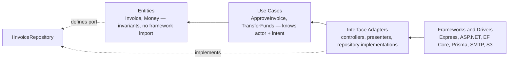

# Clean Architecture

The dependency rule exists to answer one question: where is this enforced? Not "is the code
tidy". If you cannot point at the single place that decides whether this actor may perform
this operation, the layering is decoration.

## When to Use

- A security rule is enforced in more than one place and the copies have drifted
- A background job, CLI command, or second entry point reaches the same data as the HTTP
  handler and skips a check the handler performs
- A domain entity is serialised straight into a response and internal fields leak
- Business invariants live in controllers, so a second caller can create an invalid record
- You are about to add a framework import to a file that holds business rules
- Someone asked an AI for "clean architecture" and got four layers with no enforcement point

## The Dependency Rule

Uncle Bob's 2012 article states it as: "source code dependencies can only point inwards."
Four circles, innermost first — entities, use cases, interface adapters, frameworks and
drivers. The count is schematic; the direction is not.

The security payoff of the direction is specific:

| Boundary | What it enforces | Failure if crossed the wrong way |
|---|---|---|
| Entity constructor | Invariants. An invalid object cannot exist | Anemic entity, validation in the controller, second entry point writes bad data |
| Use case signature | Authorization. Only this layer knows actor and intent | `A01:2025` — check lives in the controller, any other caller bypasses it |
| Port (interface owned by the domain) | Tenant and ownership predicates below every caller | Domain imports the ORM, so one query path skips the filter |
| Output DTO | Which fields leave the process | `API3:2023` over-fetching — password hash, internal flags, other tenants' IDs |
| Input DTO / command | Which fields a caller may set | `CWE-915` mass assignment |

## Workflow

### 1. Name the actor before naming the layer

Write the use case signature first, actor included, and make it non-optional. If the actor is
an ambient lookup (`getCurrentUser()`, a thread local, a container-injected request object)
the use case is reusable by anything, including a job that has no actor. See
[best-practices.md](best-practices.md#authorization-lives-in-the-use-case).

### 2. Put the invariant in the constructor

Anything that must always be true about the object goes in the type — factory method,
private constructor, value object. Format checks (is this a well-formed email, is this an
integer) stay at the edge. See
[best-practices.md](best-practices.md#validation-format-at-the-edge-invariants-in-the-domain).

### 3. Define the port in the layer that needs it

The domain declares `IInvoiceRepository`. Infrastructure implements it. If the interface
lives next to its implementation, the domain depends on infrastructure and the arrow is
backwards. See [best-practices.md](best-practices.md#ports-belong-to-the-inner-layer).

### 4. Map at the boundary, explicitly

Every response is built from an output DTO with named fields. No entity, no ORM model, and
no `toJSON()` on a domain object reaches a serialiser. This is a structural control, not
ceremony — see [best-practices.md](best-practices.md#output-dtos-are-an-access-control).

### 5. Price the indirection

For each new abstraction, state the cost: query count per request, allocations per request,
what is retained and for how long. A repository per aggregate is correct and turns one
list screen into 1+N queries unless you add a read path. See
[best-practices.md](best-practices.md#repository-per-aggregate-and-the-query-count).

### 6. Check the container lifetimes

A singleton holding a request-scoped object — a user, a `DbContext`, a tenant — is a
stale-authorization bug and a retained-reference leak at the same time. See
[best-practices.md](best-practices.md#di-lifetimes-are-a-security-boundary).

### 7. Verify

Run [checklist.md](checklist.md). Every unchecked item is a change or a stated residual
risk.

## When NOT to Use This

Be blunt about this. Most projects that adopt the pattern do not need it.

- **CRUD with no domain rules.** If every operation is "validate shape, write row, return
  row", four layers buy nothing. A thin controller plus a scoped query is the honest answer:
  one file, the tenant predicate visible in the query, no mapper. Adding entities, use
  cases, ports, and DTOs to that gives you four files to read before you can see the
  `WHERE` clause — and reviewers who cannot see the predicate stop checking it.
- **A read-only reporting or export surface.** Projections do not have invariants. Go from
  SQL to DTO and skip the entity. Loading aggregates to flatten them is where the N+1 comes
  from.
- **Prototypes with an expiry date.** The pattern pays back over years of change. If the
  code will not exist in three months, the interest never arrives.
- **A single-purpose function, a Lambda, a script.** One entry point means one enforcement
  point already.
- **Where the team will not hold the line.** Half-applied layering is worse than none: the
  folders imply an enforcement point that does not exist, so nobody looks for the check.

Adopt it when there is more than one entry point into the same data, or when invariants
exist that a database constraint cannot express. Those two conditions are what the pattern
is for.

## Related Skills

- `core/owasp` — the Top 10 and ASVS mapping these findings cite
- `core/api-security` — object and property level authorization at the API surface
- `advanced/secure-architecture` — boundaries between processes, tenants, and services;
  this skill is boundaries inside one process
- `architecture/performance` — owns heap, retention, and leak detail; linked from here
  rather than duplicated
- `architecture/hexagonal`, `architecture/ddd`, `architecture/cqrs` — adjacent patterns

## Supporting Files

- [README.md](README.md) — purpose, layout, standards, limitations
- [checklist.md](checklist.md) — pre-return verification, grouped by boundary
- [best-practices.md](best-practices.md) — patterns with cost and security implication
- [common-mistakes.md](common-mistakes.md) — what goes wrong and why the fix holds
- [troubleshooting.md](troubleshooting.md) — when the pattern does not fit or conflicts
- [prompts.md](prompts.md) — prompts that produce structure, plus anti-patterns
- [references/](references/) — sources, each with the date verified
- [examples/](examples/) — eight before/after pairs
