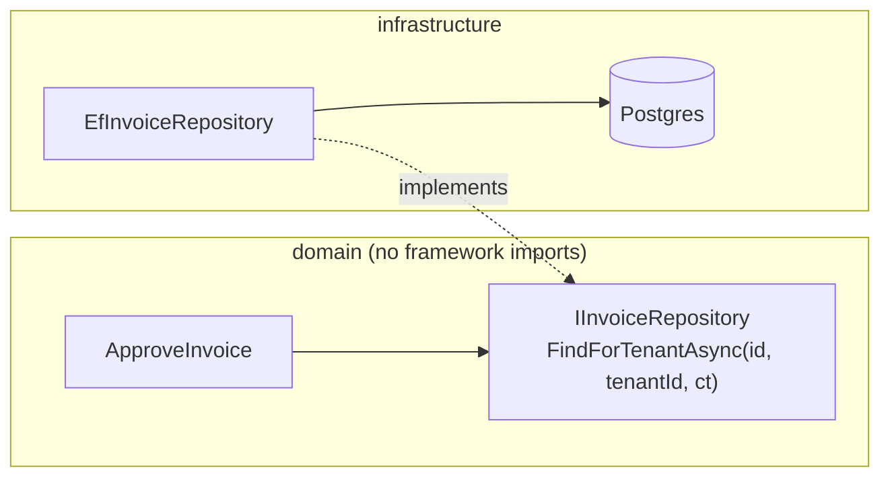

# Clean Architecture Best Practices

Each pattern below names what it enforces, what it costs at runtime, and the standard it maps
to. A structural recommendation without a cost note is incomplete.

## Authorization Lives in the Use Case

`A01:2025` · ASVS V8 · `CWE-602`, `CWE-1220`

The use case is the only layer that knows both the actor and the intent. The controller knows
the actor but not the intent (it has an HTTP verb, not a business rule). The repository knows
the intent but not the actor unless you pass it. So the decision belongs in the use case, and
the actor belongs in its signature.

Vulnerable: the check is in the controller.

```csharp
// Vulnerable: any other caller of the use case gets no check at all
[HttpPost("invoices/{id}/approve")]
public async Task<IActionResult> Approve(Guid id, CancellationToken ct)
{
    if (!User.IsInRole("approver")) return Forbid();     // the only check
    await _approveInvoice.ExecuteAsync(id, ct);
    return NoContent();
}

public sealed class ApproveInvoice
{
    public async Task ExecuteAsync(Guid invoiceId, CancellationToken ct) { /* ... */ }
}
```

The nightly retry job, the admin CLI, the gRPC endpoint added next quarter, and the message
consumer all call `ExecuteAsync(invoiceId, ct)`. None of them is in an HTTP context, so none
of them runs `User.IsInRole`. Nothing about the signature suggests anything is missing.

Fixed: the actor is a required parameter and the decision is inside.

```csharp
public sealed record Actor(Guid UserId, Guid TenantId, IReadOnlySet<string> Permissions);

public sealed class ApproveInvoice
{
    private readonly IInvoiceRepository _invoices;
    private readonly IClock _clock;

    public ApproveInvoice(IInvoiceRepository invoices, IClock clock)
        => (_invoices, _clock) = (invoices, clock);

    public async Task<ApprovalResult> ExecuteAsync(
        Actor actor, Guid invoiceId, CancellationToken ct)
    {
        if (!actor.Permissions.Contains("invoice:approve"))
            return ApprovalResult.Denied("insufficient_permission");

        // tenant scoping is part of the lookup, not a later comparison
        var invoice = await _invoices.FindForTenantAsync(invoiceId, actor.TenantId, ct);
        if (invoice is null) return ApprovalResult.NotFound();

        if (invoice.RequesterId == actor.UserId)
            return ApprovalResult.Denied("self_approval");   // a rule no route guard knows

        invoice.Approve(actor.UserId, _clock.UtcNow);         // invariants inside the entity
        await _invoices.SaveAsync(invoice, ct);
        return ApprovalResult.Approved(invoice.Id);
    }
}
```

Why it removes the option rather than relying on discipline: `ExecuteAsync(invoiceId, ct)` no
longer compiles. A new caller must produce an `Actor`, and the only honest way to produce one
is from a verified credential. A reviewer sees a missing argument - a build failure - instead
of a missing `if`, which is invisible.

Two rules that follow:

- Do not let the actor arrive ambiently. `HttpContext.User`, a thread local, a
  `contextvar`, or a container-injected `ICurrentUser` all make the parameter optional again,
  and a background job resolving `ICurrentUser` gets whatever the last request left behind.
- Service-to-service and job callers need a real principal too. A job that legitimately acts
  for the system gets `Actor.System(tenantId)` - explicit, greppable, and auditable - not a
  bypass path.

Cost: one extra parameter, no allocation of consequence. `Actor` is a small record; if you are
constructing it per call from claims, cache the parsed permission set per request, not per
process.

## Validation: Format at the Edge, Invariants in the Domain

`A05:2025`, `A06:2025` · ASVS V2 · `CWE-20`, `CWE-915`

Two different jobs get confused because both are called validation.

| Where | Question | Failure mode if it moves |
|---|---|---|
| Edge (controller, DTO schema) | Is this well-formed? Correct type, length, character set, unknown keys rejected | Parse errors become domain exceptions; 500 instead of 400 |
| Domain (constructor, factory, value object) | Is this a legal state for the business? | A second entry point creates an invalid record |

An entity that cannot be constructed in an invalid state is worth more than a validator
someone forgets to call.

```typescript
// Edge: format only. .strict() is what stops mass assignment (CWE-915)
const CreateShipmentBody = z.object({
  destination: z.string().min(1).max(200),
  weightGrams: z.number().int().positive(),
  declaredValueCents: z.number().int().nonnegative(),
}).strict();

// Domain: invariants. No import from zod, express, or the ORM in this file.
export class Shipment {
  private constructor(
    readonly id: ShipmentId,
    readonly tenantId: TenantId,
    readonly weight: Weight,
    readonly declaredValue: Money,
    private status: ShipmentStatus,
  ) {}

  static open(input: {
    id: ShipmentId; tenantId: TenantId; weight: Weight; declaredValue: Money;
  }): Shipment {
    if (input.weight.grams > 30_000) {
      throw new DomainError("shipment_over_carrier_limit");
    }
    if (input.declaredValue.cents > 500_000 && input.weight.grams < 100) {
      throw new DomainError("declared_value_requires_inspection");
    }
    return new Shipment(input.id, input.tenantId, input.weight,
                        input.declaredValue, "open");
  }

  dispatch(at: Date): void {
    if (this.status !== "open") throw new DomainError("shipment_not_open");
    this.status = "dispatched";
  }
}
```

`private constructor` plus a static factory is the whole trick. There is no path to a
`Shipment` that skipped `open()`. The rehydration path from persistence gets its own named
factory (`Shipment.rehydrate`) which is allowed to trust the database - mark it clearly and
keep it internal to the infrastructure package if the language lets you.

Cost: value objects (`Weight`, `Money`, `ShipmentId`) allocate. On a hot list endpoint
returning 500 rows, constructing 500 aggregates with 4 value objects each is 2500 short-lived
objects per request. That is fine for a write path and wasteful for a read path - see
[Repository per Aggregate and the Query Count](#repository-per-aggregate-and-the-query-count).

## Ports Belong to the Inner Layer

`A01:2025` · ASVS V8, V15 · `CWE-653`

The interface belongs to the layer that calls it, not the layer that implements it. This is
not a filing preference. It is what decides whether the tenant predicate can be skipped.



If `IInvoiceRepository` lives in the infrastructure project, the domain project must reference
infrastructure to compile, which means the domain can now import `DbContext` - and once one
use case queries directly, the predicate that lives in the repository is no longer below every
caller. With the interface in the domain, the reference goes the other way and the ORM type is
not even visible from the inner layer. The compiler enforces the boundary; nobody has to
remember it.

Two properties the port must have:

- Intention-revealing methods, not a query language. `FindForTenantAsync(id, tenantId, ct)`
  and `ListOpenForCustomerAsync(customerId, page, ct)`. Not `IQueryable<Invoice> Query()` and
  not `find(criteria: object)`.
- Materialized results. Returning `IQueryable`, a lazy relation, or an ORM query object drags
  persistence semantics - and the tenant filter's composability - past the boundary. See
  [examples/README.md](examples/README.md#repository-returning-iqueryable).

Honest counterpoint: one interface with exactly one implementation and no test double is
ceremony. Add the port when there are two implementations, when the domain must compile
without the framework, or when the port is where a security predicate is pinned. Otherwise a
concrete class in the domain that owns its own SQL is a defensible choice - say so rather than
generating an interface per class.

## Output DTOs Are an Access Control

`A01:2025` · `API3:2023` · ASVS V8, V14 · `CWE-213`

An explicit output DTO is the structural fix for over-fetching. The alternative - returning
the entity and trusting a serializer annotation - fails the moment someone adds a field.

```python
# Vulnerable: the response shape is whatever the ORM model happens to have today
@app.get("/api/users/{user_id}")
def get_user(user_id: int):
    user = session.get(UserRow, user_id)
    return jsonify(user.to_dict())     # password_hash, is_internal, stripe_customer_id
```

```python
# Fixed: the use case decides which fields leave, in the domain layer
from dataclasses import dataclass, asdict

@dataclass(frozen=True)
class UserProfileView:
    id: int
    display_name: str
    email: str
    created_at: str

class GetUserProfile:
    def __init__(self, users: UserRepository) -> None:
        self._users = users

    def execute(self, actor: Actor, user_id: int) -> UserProfileView | None:
        user = self._users.find_in_tenant(user_id, actor.tenant_id)
        if user is None:
            return None
        # visibility is a business rule, so it lives here
        email = user.email if (actor.user_id == user.id or actor.can("user:read_email")) else ""
        return UserProfileView(
            id=user.id,
            display_name=user.display_name,
            email=email,
            created_at=user.created_at.isoformat(),
        )
```

Why it removes the option: the DTO is an allowlist by construction. A new column on
`UserRow`, a new relation, or a new internal flag cannot appear in the response, because
nothing copies it there. Deny-list approaches - `@JsonIgnore`, `exclude = [...]`,
`serializer.exclude_fields` - invert the default, so the next field added is exposed until
someone remembers to hide it.

Field-level authorization is a use case decision, as above, not a serializer concern. The
serializer does not know who is asking.

Cost, stated honestly: mapping is real work. One dataclass allocation and N field copies per
returned object, per request. At 500 objects per response it is measurable in a profile and
still an order of magnitude below the query. Where it stops mattering:

- Below a few hundred objects per response, the mapping is noise next to the database round
  trip and JSON encoding.
- Above that, do not delete the DTO - skip the entity. Query straight into the DTO
  (`SELECT id, display_name, ... ` projected into the view type) so you pay one materialization
  instead of two.
- Reflection-based mappers (AutoMapper-style, `ObjectMapper` conventions) are where mapping
  cost actually shows up, and they also silently propagate new fields, which defeats the
  control. Hand-written mapping is faster and safer here. This is one of the few places where
  the tedious option is the correct one.

## Repository per Aggregate and the Query Count

`A06:2025` · `API4:2023` · `CWE-1050`

One repository per aggregate root is the correct rule and it produces N+1 queries the first
time a screen needs data from two aggregates. Show the count, not the warning.

```typescript
// Vulnerable: 1 + N + N queries. Each repository is individually correct.
async function listOrdersForAdmin(actor: Actor): Promise<OrderRow[]> {
  const orders = await orderRepo.listForTenant(actor.tenantId, 100);   // 1 query
  const rows: OrderRow[] = [];
  for (const order of orders) {
    const customer = await customerRepo.byId(order.customerId);        // 100 queries
    const invoice = await invoiceRepo.byOrderId(order.id);             // 100 queries
    rows.push(toRow(order, customer, invoice));
  }
  return rows;                                                        // 201 total
}
```

At 201 round trips of 2 ms, the handler spends 400 ms in the database driver and holds a
connection for all of it. Under 50 concurrent requests that is a pool exhaustion incident, and
an unauthenticated caller who can trigger it has a denial of service - `API4:2023`.

Two fixes, and the choice matters:

```typescript
// Fix A: batch inside the loop's layer. 3 queries total.
const orders = await orderRepo.listForTenant(actor.tenantId, 100);
const customerIds = [...new Set(orders.map(o => o.customerId))];
const customers = await customerRepo.byIds(customerIds, actor.tenantId);       // 1
const invoices = await invoiceRepo.byOrderIds(orders.map(o => o.id), actor.tenantId); // 1
```

```typescript
// Fix B: a read model. 1 query, no aggregates constructed.
interface OrderListReadModel {
  listForTenant(tenantId: TenantId, limit: number): Promise<OrderRow[]>;
}
// implemented with one SQL join projected straight into OrderRow
```

Fix A keeps one model and pays 3 queries. Fix B pays 1 query and accepts a second read path,
which means the tenant predicate now exists in two places - write it into the SQL and test it,
or you have traded a performance bug for `A01`. Say which trade you made.

Retention cost of the write path: an ORM change tracker holds every entity it materialized for
the length of the unit of work. Loading 10 000 aggregates to update three of them retains all
10 000 until the context is disposed. Batch and dispose per chunk. Heap-level detail lives in
[`skills/architecture/performance/`](../performance/best-practices.md) - L7 (large result sets)
and L3 (connection lifetime) - not here.

Assert the query count in a test where N+1 is plausible. It is the only way the regression
stays fixed.

## DI Lifetimes Are a Security Boundary

`A01:2025` · `CWE-488` · ASVS V7, V8

A singleton that holds a request-scoped object is two bugs at once: the first request's data
serves every later request, and the object graph is never released. The .NET DI documentation
calls the general shape a captive dependency; the container-independent statement is that an
object may only depend on something whose lifetime is at least as long as its own.

| Dependency | Lifetime | Why |
|---|---|---|
| Configuration, clock, metrics, HTTP client factory, in-memory cache | Singleton | Stateless or process-lifetime by design |
| ORM context / unit of work | Scoped (per request, per message, per job run) | Not thread-safe, holds a connection and a change tracker |
| Repository, use case | Scoped | Depends on the unit of work |
| Current actor / tenant context | Scoped, and never captured by anything longer-lived | It is request data |
| Anything holding a connection or a cursor | Scoped or transient with explicit disposal | Release must be tied to the unit of work |

Vulnerable registration:

```csharp
// Vulnerable: PricingService lives for the process and captures request state
public sealed class PricingService
{
    private readonly AppDbContext _db;        // scoped: not thread-safe, holds a connection
    private readonly Actor _actor;            // request data, frozen at first resolution
    private readonly Dictionary<string, decimal> _rates = new();  // grows without bound

    public PricingService(AppDbContext db, Actor actor) => (_db, _actor) = (db, actor);

    public async Task<decimal> RateFor(string sku, CancellationToken ct)
    {
        if (_rates.TryGetValue(sku, out var cached)) return cached;   // cross-tenant hit
        var rate = await _db.Rates
            .Where(r => r.Sku == sku && r.TenantId == _actor.TenantId)
            .Select(r => r.Amount)
            .SingleAsync(ct);
        _rates[sku] = rate;                   // no tenant in the key, no bound, no TTL
        return rate;
    }
}

builder.Services.AddSingleton<PricingService>();      // the bug
builder.Services.AddDbContext<AppDbContext>(o => o.UseNpgsql(cs));   // scoped
builder.Services.AddScoped<Actor>(sp => ActorFactory.FromClaims(sp));
```

Three failures from one line. Every request prices against the first request's tenant
(`A01:2025`, a cross-tenant data leak, not a caching bug). The captured `AppDbContext` outlives
its scope, so one connection is pinned for the process lifetime and concurrent requests corrupt
its state. `_rates` never evicts, so the process grows with the SKU space.

Fixed:

```csharp
// Fixed: scoped where request data is involved, singleton only for the shared cache
public sealed class PricingService
{
    private readonly AppDbContext _db;
    private readonly IRateCache _cache;                    // singleton, tenant in the key

    public PricingService(AppDbContext db, IRateCache cache) => (_db, _cache) = (db, cache);

    public async Task<decimal> RateFor(Actor actor, string sku, CancellationToken ct)
    {
        var key = $"{actor.TenantId}:{sku}";               // identity is part of the key
        if (_cache.TryGet(key, out var cached)) return cached;

        var rate = await _db.Rates
            .Where(r => r.Sku == sku && r.TenantId == actor.TenantId)
            .Select(r => r.Amount)
            .SingleAsync(ct);
        _cache.Set(key, rate, TimeSpan.FromMinutes(5));    // bounded size, bounded age
        return rate;
    }
}

builder.Services.AddScoped<PricingService>();
builder.Services.AddSingleton<IRateCache>(_ => new BoundedRateCache(maxEntries: 10_000));
```

The framework will tell you, if you let it. `Host.CreateApplicationBuilder` in Development
runs scope validation, which verifies that scoped services are not resolved from the root
provider and not injected into singletons; it throws when `BuildServiceProvider` is called.
Turn it on in every environment you can afford to fail fast in, and in CI. Containers in other
ecosystems have equivalents - NestJS scopes bubble up, so injecting a `REQUEST`-scoped provider
into a default-scoped one silently promotes the consumer; verify the behaviour of your version
rather than assuming.

Two further hazards in this family:

- A use case registered as a singleton that memoizes a lookup in an instance field. The
  memo is correct for one tenant and wrong for every other one. Use cases are scoped, and any
  cache they touch is an injected, keyed, bounded cache - not a field.
- Background services. A hosted service or worker is a singleton by nature, so it must not
  take a scoped dependency in its constructor. Inject the scope factory, open a scope per unit
  of work, resolve inside it, and dispose it. That scope is also where the job's `Actor` is
  constructed.

Disposal: the container disposes what it created. It does not dispose an instance you
constructed yourself and handed over (`AddSingleton<IFoo>(new Foo())` leaves `Foo` to you), and
it does not dispose objects a factory returns from a captured field. If you resolve from a
scope you opened, you own the `using`.

## Thread Cancellation Through the Port

`A06:2025` · `API4:2023` · `CWE-770`, `CWE-1088`

A port without a cancellation parameter forces every adapter to invent its own timeout, which
in practice means none. The entry point owns the deadline; the port carries it.

```csharp
// The port declares it, so no implementation can quietly omit it
public interface ICarrierRatesPort
{
    Task<CarrierQuote> QuoteAsync(QuoteRequest request, CancellationToken ct);
}
```

```csharp
// Adapter: its own timeout, linked to the caller's token, plus a bounded body read
public sealed class HttpCarrierRatesAdapter : ICarrierRatesPort
{
    private readonly HttpClient _http;   // from IHttpClientFactory, Timeout set at registration

    public async Task<CarrierQuote> QuoteAsync(QuoteRequest request, CancellationToken ct)
    {
        using var cts = CancellationTokenSource.CreateLinkedTokenSource(ct);
        cts.CancelAfter(TimeSpan.FromSeconds(2));          // dependency budget, not the caller's
        using var response = await _http.PostAsJsonAsync("/quotes", request, cts.Token);
        response.EnsureSuccessStatusCode();
        return await response.Content.ReadFromJsonAsync<CarrierQuote>(cts.Token)
               ?? throw new CarrierProtocolException("empty_quote");
    }
}
```

Without this, a carrier that accepts connections and never responds pins one request thread and
its whole object graph per call until the process dies. The domain does not know what a socket
is, which is the point - it knows there is a deadline, because `ct` is in the signature.

Rules: the token is a parameter, never a field. Every port method that does I/O takes one. The
adapter's timeout is its own dependency budget, linked to the caller's token so either can
cancel. `A06` when the design never had a timeout, `A02` when a timeout exists in the library
and was left at its default.

## The Cost of the Whole Pattern

Say this out loud before recommending the structure.

| Cost | Size | When it stops mattering |
|---|---|---|
| Mapping per boundary crossing | 2 to 3 object copies per entity per request | Below a few hundred objects per response |
| Files to read to follow one request | 4 to 6 instead of 1 | Never - it is a permanent navigation tax you pay for a permanent enforcement point |
| Aggregate materialization on read paths | N value objects per row | Use a read model and skip the entity |
| Repository per aggregate | 1+N queries across aggregates | Batch loaders or a read model |
| Interfaces with one implementation | Indirection with no benefit | Do not create them |

The pattern is worth it when there is more than one entry point into the same data, or when
invariants exist that a database constraint cannot express. A two-endpoint CRUD service with
no domain rules gets four layers of indirection and zero benefit: the honest implementation is
a thin controller plus a scoped query, with the tenant predicate visible on the same screen as
the route. See `SKILL.md` for the full "when NOT to use this" list.

## Sources

- [references/dependency-rule.md](references/dependency-rule.md) - the dependency rule
- [references/di-lifetimes.md](references/di-lifetimes.md) - captive dependencies, scope
  validation, `DbContext` lifetime
- <https://owasp.org/Top10/2025/>
- <https://owasp.org/API-Security/editions/2023/en/0x11-t10/>
- <https://cwe.mitre.org/>
