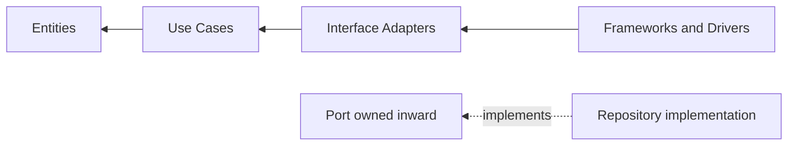

# The Dependency Rule

Verified 2026-07-28 against Robert C. Martin's original article:
<https://blog.cleancoder.com/uncle-bob/2012/08/13/the-clean-architecture.html>.

## Source

Robert C. Martin, "The Clean Architecture," published 2012-08-13.

The article presents a synthesis of Hexagonal Architecture, Onion Architecture, Screaming
Architecture, DCI, and BCE. It uses four schematic circles:

1. Entities
2. Use Cases
3. Interface Adapters
4. Frameworks and Drivers

The article says the circles are schematic. A system may need more than four. The invariant is
not the number of layers; it is dependency direction.

## The Rule

The article states: "source code dependencies can only point inwards."

It then clarifies that inner circles know nothing about outer circles. The name or data format of
an outer-layer type must not be mentioned by code in an inner circle. This applies to functions,
classes, variables, and data formats.

That is stronger than "call direction points inward." Control flow can cross outward through
inversion: an inner use case calls a port that it owns, and an outer adapter implements that port.
The source dependency still points inward because the implementation imports the interface, not
the other way around.

## What Each Circle Means Here

### Entities

Enterprise-wide business rules in the original article. In this skill, entities and value objects
hold invariants and legal transitions. They have no ORM, web, serializer, or container import.

Security effect: a second entry point cannot construct invalid state merely because it skipped an
HTTP validator. The constructor or factory is the enforcement point.

Runtime cost: rich values allocate. Do not construct an aggregate for a read-only projection that
needs five columns and no rule.

### Use Cases

Application-specific business rules. They orchestrate entities and direct data across their
boundary.

Security effect: the use case is where actor and intent meet, so it is the natural place for an
authorization decision. An actor must be an explicit, non-optional input. Controller-only checks
are bypassable by jobs, CLI commands, message handlers, and other controllers.

Runtime cost: normally one small object per scope and negligible call overhead. The real cost is
navigation across files and any I/O the orchestration creates.

### Interface Adapters

Controllers, presenters, gateways, and persistence translators convert data between inner-layer
formats and outer formats.

Security effect: explicit input and output DTO mapping is an allowlist. It prevents unknown input
properties from reaching an entity and prevents internal entity properties from reaching JSON.

Runtime cost: mapping copies fields and allocates DTOs. For large read results, project directly
from the query to the same explicit DTO instead of removing the DTO.

### Frameworks and Drivers

The database, web framework, devices, and other details. These are kept at the outer edge so the
business rules do not depend on them.

Security effect: an ORM session cannot be used as a shortcut by inner code, so tenant-filtered
repository ports remain the available path. This only holds when module references enforce the
boundary.

Runtime cost: frameworks own connections, scopes, serializers, and hidden lazy behaviour. Their
lifetime and disposal rules must be verified against their documentation.

## Boundary Data

The article warns against passing database rows or framework data structures inward. Data crossing
a boundary should be simple and convenient for the inner circle. In this skill that becomes:

- commands and actors into use cases;
- domain entities or purpose-specific facts from repository ports;
- explicit output DTOs out of use cases;
- no `IQueryable`, ORM row, lazy proxy, HTTP request, or serializer object crossing inward.

The rule is not "use a DTO everywhere." It is "do not make an inner layer depend on an outer data
format." A small immutable record is enough.

## What the Source Does Not Establish

The article does not prove that Clean Architecture improves performance or security. Those are
properties of a concrete implementation. It does not prescribe:

- a fixed directory layout;
- one interface per class;
- a repository for every table;
- CQRS or event sourcing;
- a DI container;
- a required number of layers;
- a specific authorization mechanism;
- any OWASP, ASVS, or CWE mapping.

Those security mappings are this skill's application of the dependency rule, not claims made by
the 2012 article.

## Verification Notes

- Title, author context, publication date, four circle names, and dependency-rule wording were
  checked on 2026-07-28.
- The article is a design essay, not a versioned standard or RFC.
- No requirement IDs are attributed to it.
- If the article changes, re-check the quoted sentence and the boundary-data section before using
  exact wording.
