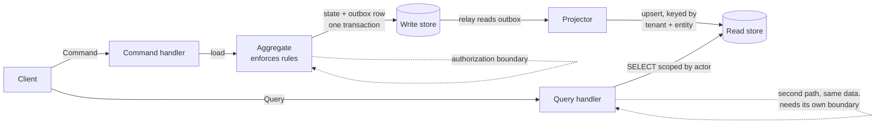

# CQRS

Commands change state and return nothing meaningful. Queries read and never write. That is the
whole pattern. Everything else — a second database, a message broker, an event store — is
optional and usually unnecessary.

The security claim in this skill is narrow and it is the point:

> A read model is a second path to the same data. It is where authorization gets forgotten.

The command side has an aggregate that loads state, checks rules, and refuses. The query side
is a `SELECT` somebody wrote for a dashboard. Same data, two paths, one guard. `A01:2025`,
`API1:2023`, `CWE-1220`.

## When to Use

- Adding a read model, projection, materialized view, or reporting query
- Writing a command handler, especially one reached from a queue
- A query joins across aggregates or tenants to build a screen
- A dashboard or export endpoint reads tables the domain code writes
- Deciding whether a feature needs two models at all
- Reviewing code where an authorization check reads from a projection
- Introducing an event store, or asked to erase personal data from one

## The Three Levels, and Where to Stop

Most projects should stop at level 1. Going further buys scaling and costs correctness.

| Level | Shape | Consistency | What it costs |
|---|---|---|---|
| 0 | One model, CRUD | Immediate | Nothing. Honest default for CRUD screens |
| 1 | Separate command and query methods, separate DTOs, one database | Immediate | A little duplication. No new failure mode |
| 2 | Separate read tables in the same database, updated in the same transaction | Immediate | Write amplification, schema drift |
| 3 | Separate read store, updated asynchronously | Eventual | Projection lag, dual writes, replay cost, stale-read authorization |
| 4 | Event store as source of truth (event sourcing) | Eventual | Replay semantics, PII in an immutable log, event schema evolution |

Level 3 is where the security holes in this skill appear. Level 4 is a separate decision — see
[best-practices.md](best-practices.md#event-sourcing-optional-and-separate). CQRS does not
require event sourcing and event sourcing is not a prerequisite for anything here.

## Flow

The dotted notes are the finding. One boundary at the aggregate is not enough when the query
handler reaches the read store directly.

## Workflow

### 1. Decide the level before writing code

Ask what actually differs between the read shape and the write shape. If the answer is
"nothing, it is a form and a table", stop at level 0 and say so. See
[When NOT to Use This](#when-not-to-use-this).

### 2. Make the command a command

Named after the business intent, not the table. Returns an identifier or an acknowledgement,
not the new entity. Validated at the boundary, authorized inside the aggregate, idempotent by
command ID. See [best-practices.md](best-practices.md#commands).

### 3. Put authorization data in the projection key

If the read model does not carry tenant and owner, every consumer must remember to filter, and
one will not. Make the tenant part of the primary key and the repository signature so an
unscoped query cannot be written. See
[best-practices.md](best-practices.md#projections-carry-authorization-not-just-display-data).

### 4. Shape the read model per use case, not by joining everything

A denormalised view built by joining every table is how internal fields reach a response.
`API3:2023`. Project the columns the screen needs, nothing more.

### 5. Never authorize from an eventually consistent projection

A permission change is a command. A permission check is not a query against a projection that
may be seconds behind. Read the authoritative store, or accept that revocation is delayed and
say so in writing. See [best-practices.md](best-practices.md#eventual-consistency-is-a-hazard).

### 6. Bound the projector

State per event, queue depth, replay cost. A projector holding an in-memory map keyed by entity
is an unbounded leak. `API4:2023`, `CWE-401`. See
[best-practices.md](best-practices.md#projector-resource-lifetime).

### 7. Write once, publish from the same transaction

A database write plus a broker publish with no transaction loses events silently. Use an outbox.
See [best-practices.md](best-practices.md#dual-writes-and-the-outbox).

### 8. Report

Per finding: which side (command, projector, query), what a caller can read or change that they
should not, the standard, the fix, and whether the fix removes the option or relies on
discipline. Prefer fixes that remove the option.

## When NOT to Use This

CQRS is the most over-applied pattern in this set. Say no out loud.

Do not split when:

- The screen is a form over a table. Create, edit, list, delete, one shape. Two models here buy
  nothing and double the places authorization can be missed.
- Reads and writes have the same shape and the same access rules. The read model would be the
  write model with a different class name.
- The read volume is not a problem. "It will scale later" is not a measurement. Add an index.
- The team cannot yet answer where authorization is enforced today. Splitting the model spreads
  that answer across two codebases.
- You need a report and nothing else. A read replica plus a few tuned queries gives you the read
  scaling without eventual consistency, projectors, or a broker.
- Consistency is required by the business rule. Balance checks, quota enforcement, uniqueness —
  these need the authoritative store, not a projection.

The honest default: one model, one store, commands and queries as separate methods on separate
services, queries returning explicit DTOs. That is level 1, it is free, and it delivers most of
the maintainability benefit. Reach for level 3 when you have a measured read/write asymmetry and
a written answer for stale reads.

Fowler's own summary, worth quoting to anyone proposing this repository-wide: for most systems
CQRS adds risky complexity, and it should be applied to one bounded context, never to a whole
system. See [references/cqrs-sources.md](references/cqrs-sources.md).

## Related Skills

- `skills/core/owasp/` — the standards these findings cite
- `skills/core/api-security/` — idempotency keys, response shaping, resource limits
- `skills/core/database-security/` — row-level security, query scoping
- `skills/architecture/performance/` — owns leak shapes, bounds, and backpressure detail
- `skills/architecture/scalability/` — capacity planning once the split is justified
- `skills/architecture/event-driven/` — event contracts and delivery semantics
- `skills/architecture/ddd/` — aggregates and bounded contexts

## Supporting Files

- [README.md](README.md) — purpose, layout, limitations, security notes
- [checklist.md](checklist.md) — pre-return verification, grouped by side
- [best-practices.md](best-practices.md) — patterns with code, each with its security and cost note
- [common-mistakes.md](common-mistakes.md) — what goes wrong, and the wrong fixes
- [troubleshooting.md](troubleshooting.md) — when the split does not fit
- [prompts.md](prompts.md) — prompts that produce structure, plus an anti-pattern table
- [references/](references/) — sources with the date verified
- [examples/](examples/) — eight before/after pairs
