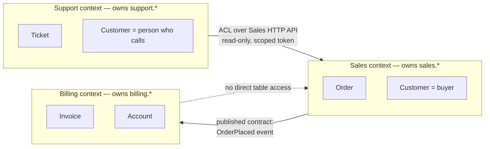
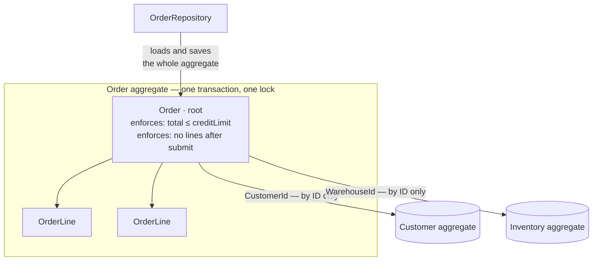

# DDD Best Practices
Each pattern states the boundary it creates and what it costs at runtime. A construct that creates no boundary and costs indirection is not on this list.
## Ubiquitous Language
Naming discipline, not a control. It matters because a misunderstood word becomes a wrong rule, but a codebase with perfect naming and no enforced boundary is still insecure. Do not report inconsistent language as a security finding. The test that survives review: the word in the code is the word the domain expert says, and it means one thing inside this context. If `Customer` means "billing account" in one file and "person with a login" in another, you have found a context boundary, not a naming bug.
```typescript
// Vague: three different concepts, one word, and nobody can tell which is authorized
function process(data: any, user: any): void
// Named: the operation, the actor, and the object are all readable
function submitTimesheetForApproval(timesheet: Timesheet, submitter: EmployeeId): void
```
Cost: none at runtime. Renaming costs review time and merge conflicts. Do it during a change you are already making, not as a sweep.
## Bounded Context Is a Trust Boundary
This is the security spine. A context owns its tables. Another context reads them through a published contract or not at all. Two contexts sharing a table share a blast radius: a migration in one changes the meaning of a column the other filters on, and the filter still compiles (`CWE-653` Improper Isolation or Compartmentalization, `CWE-1220` Insufficient Granularity of Access Control, `A01:2025`).

Three things make the boundary real, and all three are checkable in source:
| Claim | How you verify it |
|---|---|
| Owns its tables | Migrations for `sales.*` live only in the sales module |
| Own DB principal | The connection string for sales uses a role with no grant on `support.*` |
| Published contract | Every cross-context call goes through a named interface or event type |
```sql
-- The boundary as a grant, not a convention. Postgres.
CREATE SCHEMA sales;
CREATE SCHEMA support;
CREATE ROLE sales_app LOGIN;
CREATE ROLE support_app LOGIN;
GRANT USAGE ON SCHEMA sales TO sales_app;
GRANT SELECT, INSERT, UPDATE, DELETE ON ALL TABLES IN SCHEMA sales TO sales_app;
GRANT USAGE ON SCHEMA support TO support_app;
GRANT SELECT, INSERT, UPDATE, DELETE ON ALL TABLES IN SCHEMA support TO support_app;
-- support_app has no grant on sales.*. A stray query fails at the database,
-- not at code review.
```
Cost: cross-context reads become a call or a copy. That is latency and staleness you did not have with a join. Pay it where the boundary matters and do not split contexts you have no reason to isolate. Per-context DB roles also mean more connection pools; see `skills/architecture/performance/` for pool sizing.
## Aggregate Is the Consistency and Authorization Unit
Draw the aggregate from the invariant, not from the data shape. The question is not "what belongs together in a form" but "what must be true in one transaction". An aggregate root is the right place to enforce an invariant because it is the only object that can see the whole invariant. A service can see it too, until a second service is written.

### Invariants live inside the boundary
```python
# Vulnerable: the rule lives in a service, so the second write path skips it
class Order:
    def __init__(self, order_id: str, tenant_id: str):
        self.id = order_id
        self.tenant_id = tenant_id
        self.status = "draft"
        self.lines: list[OrderLine] = []
class OrderService:
    def add_line(self, order: Order, sku: str, qty: int) -> None:
        if order.status != "draft":          # the only place this is checked
            raise DomainError("order_locked")
        order.lines.append(OrderLine(sku, qty))
# Elsewhere, six months later, an import job:
#   order.lines.append(OrderLine(sku, qty))   # submitted orders now mutate
```
```python
# Fixed: state is private to the aggregate and every mutation goes through a method
from dataclasses import dataclass, field
from decimal import Decimal
class DomainError(Exception):
    pass
@dataclass(frozen=True)
class OrderLine:
    sku: Sku
    quantity: int
    unit_price: Money
class Order:
    MAX_LINES = 200
    def __init__(self, order_id: OrderId, tenant: TenantId, credit_limit: Money):
        self._id = order_id
        self._tenant = tenant
        self._credit_limit = credit_limit
        self._status = "draft"
        self._lines: list[OrderLine] = []
        self._events: list[object] = []
    @property
    def id(self) -> "OrderId":
        return self._id
    @property
    def lines(self) -> tuple[OrderLine, ...]:
        return tuple(self._lines)          # copy out, no external append
    def add_line(self, sku: "Sku", quantity: int, unit_price: "Money") -> None:
        if self._status != "draft":
            raise DomainError("order_locked")
        if quantity < 1:
            raise DomainError("invalid_quantity")
        if len(self._lines) >= self.MAX_LINES:
            raise DomainError("too_many_lines")
        candidate = self._total() + unit_price * quantity
        if candidate > self._credit_limit:
            raise DomainError("credit_limit_exceeded")
        self._lines.append(OrderLine(sku, quantity, unit_price))
    def submit(self, submitter: "UserId") -> None:
        if self._status != "draft":
            raise DomainError("already_submitted")
        if not self._lines:
            raise DomainError("empty_order")
        self._status = "submitted"
        self._events.append(OrderSubmitted(self._id, self._tenant, submitter))
    def pull_events(self) -> list[object]:
        events, self._events = self._events, []
        return events
    def _total(self) -> "Money":
        return sum((l.unit_price * l.quantity for l in self._lines), Money.zero("USD"))
```
Why the fix holds: there is no public mutator. The import job cannot append to `_lines` without going through `add_line`, so it cannot skip the status check. The rule is not enforced by discipline; the alternative was removed.
Cost: the whole aggregate loads on every write. Keep it small. An `Order` with 20 000 lines means 20 000 rows loaded to change one quantity — that is the read/write split argument, see `skills/architecture/cqrs/`.
### Reference other aggregates by ID
```typescript
// Vulnerable: the object graph pulls in three aggregates and two of them are now mutable here
class Order {
  constructor(
    public customer: Customer,      // whole Customer, with its own invariants
    public warehouse: Warehouse,    // and its own transaction boundary
    public lines: OrderLine[],
  ) {}
}
// order.customer.creditLimit = Money.of(1_000_000, "USD");  // compiles. no invariant ran.
```
```typescript
// Fixed: IDs across the boundary, values inside it
class Order {
  private readonly lines: OrderLine[] = [];
  private constructor(
    private readonly id: OrderId,
    private readonly tenant: TenantId,
    private readonly customerId: CustomerId,     // reference, not the object
    private readonly warehouseId: WarehouseId,
    private readonly creditLimit: Money,         // copied in at construction
    private status: "draft" | "submitted" = "draft",
  ) {}
  static open(
    id: OrderId, tenant: TenantId, customerId: CustomerId,
    warehouseId: WarehouseId, creditLimit: Money,
  ): Order {
    return new Order(id, tenant, customerId, warehouseId, creditLimit);
  }
}
```
Why: the boundary is now visible in the type. To change a customer's credit limit you must load the `Customer` aggregate and call its method, which is where that invariant lives. Cost of the ID reference: one extra load when you genuinely need the other aggregate, and N+1 if you do it in a loop. Batch the loads or project a read model. Cost of copying `creditLimit` in: it can be stale. That is the honest trade — decide whether a stale limit for the length of a transaction is acceptable, and write the answer down.
## Value Objects Instead of Validated Primitives
An `Email` type that validates in its constructor removes the bug where validation exists and someone forgot to call it. A `TenantId` type removes the bug where a `userId` is passed where a `tenantId` was expected — which is not a type error when both are `string`, and is a cross-tenant read at runtime (`A01:2025`, `CWE-1220`).
```typescript
// Vulnerable: every parameter is a string, and the compiler is fine with any order
function findInvoice(tenantId: string, userId: string, invoiceId: string) { /* ... */ }
findInvoice(user.id, tenant.id, invoiceId);   // swapped. compiles. reads another tenant.
```
```typescript
// Fixed: branded types. Construction is the only place a value is checked.
declare const brand: unique symbol;
type Branded<T, B extends string> = T & { readonly [brand]: B };
export type TenantId = Branded<string, "TenantId">;
export type UserId = Branded<string, "UserId">;
const UUID_V4 =
  /^[0-9a-f]{8}-[0-9a-f]{4}-4[0-9a-f]{3}-[89ab][0-9a-f]{3}-[0-9a-f]{12}$/i;
export function tenantId(raw: string): TenantId {
  if (!UUID_V4.test(raw)) throw new DomainError("invalid_tenant_id");
  return raw as TenantId;
}
export function userId(raw: string): UserId {
  if (!UUID_V4.test(raw)) throw new DomainError("invalid_user_id");
  return raw as UserId;
}
function findInvoice(tenant: TenantId, actor: UserId, invoice: InvoiceId) { /* ... */ }
// findInvoice(actor, tenant, invoice);
//            ^^^^^ Argument of type 'UserId' is not assignable to parameter of type 'TenantId'.
```
Branded types are erased at runtime, so the cost is zero allocation and the check is at compile time plus one regex at the boundary. This is the cheapest security win in the skill. Money is the other case worth the class, because the failure is arithmetic on mismatched currency:
```python
# Fixed: a Money that cannot hold a float, and cannot silently add USD to EUR
from __future__ import annotations
from dataclasses import dataclass
from decimal import Decimal, ROUND_HALF_UP
@dataclass(frozen=True, slots=True)
class Money:
    amount: Decimal
    currency: str
    def __post_init__(self) -> None:
        if not isinstance(self.amount, Decimal):
            raise DomainError("money_requires_decimal")
        if len(self.currency) != 3 or not self.currency.isupper():
            raise DomainError("invalid_currency")
        object.__setattr__(
            self, "amount", self.amount.quantize(Decimal("0.01"), ROUND_HALF_UP)
        )
    @classmethod
    def zero(cls, currency: str) -> Money:
        return cls(Decimal("0"), currency)
    def __add__(self, other: Money) -> Money:
        if self.currency != other.currency:
            raise DomainError("currency_mismatch")
        return Money(self.amount + other.amount, self.currency)
    def __mul__(self, factor: int) -> Money:
        if not isinstance(factor, int):
            raise DomainError("money_scaling_requires_int")
        return Money(self.amount * factor, self.currency)
    def __gt__(self, other: Money) -> bool:
        if self.currency != other.currency:
            raise DomainError("currency_mismatch")
        return self.amount > other.amount
```
Cost: one immutable object per value, and `slots=True` to keep it small. On a hot loop that constructs millions of them, this shows up in allocation profiles. Measure before reaching for a primitive; do not assume.
## Repository per Aggregate Root
The repository is the aggregate boundary in persistence: whole aggregates in, whole aggregates out. One repository per root, not per table. A repository that returns a query object has no boundary. Filtering — including the tenant filter — now happens in whatever code holds the query, and there is no single place to enforce it.
```csharp
// Vulnerable: the boundary leaks. The caller composes the filter, so the caller can omit it.
public interface IOrderRepository
{
    IQueryable<Order> Query();          // deferred execution, filtering outside
}
// Somewhere in a handler:
var orders = repo.Query().Where(o => o.Status == "submitted").ToList();
//                                   no tenant predicate. reads every tenant.
```
```csharp
// Fixed: the repository takes the tenant and returns materialised aggregates
public interface IOrderRepository
{
    Task<Order?> FindAsync(TenantId tenant, OrderId id, CancellationToken ct);
    Task<IReadOnlyList<Order>> ListSubmittedAsync(
        TenantId tenant, int limit, CancellationToken ct);
    Task AddAsync(Order order, CancellationToken ct);
}
public sealed class OrderRepository : IOrderRepository
{
    private readonly OrderDbContext _db;
    public OrderRepository(OrderDbContext db) => _db = db;
    public async Task<Order?> FindAsync(TenantId tenant, OrderId id, CancellationToken ct)
        => await _db.Orders
            .Include(o => o.Lines)                       // aggregate loaded whole
            .SingleOrDefaultAsync(
                o => o.Id == id && o.TenantId == tenant, ct);
    public async Task<IReadOnlyList<Order>> ListSubmittedAsync(
        TenantId tenant, int limit, CancellationToken ct)
        => await _db.Orders
            .Where(o => o.TenantId == tenant && o.Status == OrderStatus.Submitted)
            .OrderByDescending(o => o.SubmittedAt)
            .Take(Math.Clamp(limit, 1, 200))             // bounded. no unpaged read.
            .Include(o => o.Lines)
            .ToListAsync(ct);
    public Task AddAsync(Order order, CancellationToken ct)
        => _db.Orders.AddAsync(order, ct).AsTask();
}
```
Why the fix holds: `TenantId` is a required parameter of every method. A caller cannot construct a query that omits it, because callers cannot construct queries. Cost, stated plainly:
- `Include` on a collection is one query with row multiplication, or N+1 if the ORM splits it. Check the generated SQL rather than trusting the mapping.
- Every method needs an explicit limit. `ListSubmitted` without `Take` is an unbounded read and a memory finding (`CWE-770`).
- A long-lived `DbContext` retains every entity it has tracked. Scope it per request or per unit of work, never as a singleton — see the resource lifecycle section. If a screen needs three joined tables and no invariant, do not force it through a repository. Query it directly on the read side. That is `skills/architecture/cqrs/`, and it is the correct answer, not a compromise.
## Domain Events: Payload and Commit Ordering
Two independent rules, both commonly broken.
### The payload is a contract, not a dump
An event carrying the full entity leaks fields the consumer should never see, and those fields land in the consumer's logs (`A01:2025`, `A09:2025`).
```typescript
// Vulnerable: internal notes, cost price, and the risk score ship to every subscriber
bus.publish({ type: "OrderSubmitted", order });   // whole entity, including internals
```
```typescript
// Fixed: an explicit, minimal, immutable payload
export interface OrderSubmitted {
  readonly type: "OrderSubmitted";
  readonly occurredAt: string;      // ISO 8601
  readonly tenantId: TenantId;
  readonly orderId: OrderId;
  readonly customerId: CustomerId;
  readonly totalMinorUnits: number;
  readonly currency: string;
}
```
Adding a field to that interface is a visible diff a reviewer can reason about. Adding a column to the entity is not.
### The consumer re-authorizes
An event is a message, not a capability. A consumer that trusts `approvedBy` in the payload has moved the authorization decision to whoever can publish to the bus (`CWE-863` Incorrect Authorization).
```python
# Vulnerable: the payload asserts authority and the consumer believes it
def on_invoice_approved(event: dict) -> None:
    if event["approvedBy"]:                    # any publisher can set this
        payments.release(event["invoiceId"], event["amountMinorUnits"])
```
```python
# Fixed: the event triggers the work; authority is re-checked against system state
def on_invoice_approved(event: InvoiceApproved) -> None:
    invoice = invoices.find(event.tenant_id, event.invoice_id)
    if invoice is None:
        log.warning("event_for_unknown_invoice", extra={"id": str(event.invoice_id)})
        return
    if not invoice.is_approved():               # authoritative state, not the message
        log.error("event_claims_approval_not_in_state",
                  extra={"id": str(event.invoice_id)})
        return
    if not approvals.actor_may_approve(event.tenant_id, invoice.approver_id, invoice.total):
        log.error("approver_lacks_authority", extra={"id": str(event.invoice_id)})
        return
    payments.release(invoice.id, invoice.total)
```
### Dispatch after commit
Collect events on the aggregate and dispatch them once the transaction commits. Publishing inside the transaction means a consumer can act on state that then rolls back.
```csharp
// Fixed: events collected on the aggregate, written to an outbox in the same transaction
public async Task<Result> Handle(SubmitOrder cmd, CancellationToken ct)
{
    await using var tx = await _db.Database.BeginTransactionAsync(ct);
    var order = await _repo.FindAsync(cmd.Tenant, cmd.OrderId, ct);
    if (order is null) return Result.NotFound();
    order.Submit(cmd.Actor);                      // invariant + event recorded in-aggregate
    foreach (var evt in order.PullEvents())
        _db.Outbox.Add(OutboxMessage.From(evt));  // same transaction as the state change
    await _db.SaveChangesAsync(ct);
    await tx.CommitAsync(ct);
    return Result.Ok();                           // a separate worker drains the outbox
}
```
Cost and consequence: the outbox gives at-least-once delivery, so every consumer must be idempotent — key on the event ID and skip a repeat. The outbox table also grows, so it needs a retention job. Both of those are real work, not footnotes. In-process dispatch has a different cost: no bound and no backpressure. One slow handler extends the publishing request by its latency, and a handler that fans out to ten more grows the call stack and the transaction window. If handlers do I/O, they belong behind the outbox, not on an in-process bus.
## Anti-Corruption Layer
The ACL is where an external model becomes your model. It is also where you stop trusting external data (`CWE-501` Trust Boundary Violation).
```typescript
// Fixed: parse, validate, and translate. The vendor DTO never reaches the domain.
import { z } from "zod";
const VendorCustomer = z.object({
  cust_no: z.string().min(1).max(32),
  email_addr: z.string().email().max(254),
  credit_cents: z.number().int().min(0).max(1_000_000_00),
  tier: z.enum(["BRONZE", "SILVER", "GOLD"]),
}).strict();          // unknown vendor fields are rejected, not passed through
export function toCustomer(raw: unknown, tenant: TenantId): Customer {
  const dto = VendorCustomer.parse(raw);
  return Customer.rehydrate({
    id: customerId(deterministicUuid(tenant, dto.cust_no)),
    tenant,                                    // tenant comes from our side, never theirs
    email: email(dto.email_addr),
    creditLimit: new Money(BigInt(dto.credit_cents), "USD"),
    tier: mapTier(dto.tier),
  });
}
```
Two details carry the security weight. `.strict()` stops an unknown vendor field from reaching a downstream mass-assignment. And `tenant` is supplied by the caller from the authenticated context — if the vendor payload could set it, the integration would be a cross-tenant write.
Cost: a translation layer per integration, and a second place to change when the vendor adds a field. That is the point. Skipping the ACL saves that maintenance and buys you a domain model shaped by someone else's schema.
## Resource Lifecycle
Three hazards DDD introduces. `skills/architecture/performance/` owns the heap-level detail; this is what to look for in a DDD codebase specifically.
### Handler subscription with no removal point
```typescript
// Vulnerable: subscribed in a constructor, never removed. Handlers accumulate per instance
// and each one retains the projector it closed over.
class OrderProjector {
  constructor(private bus: EventBus, private db: Db) {
    bus.on("OrderSubmitted", (e) => this.apply(e));   // no handle, no removal
  }
}
```
```typescript
// Fixed: subscription returns a disposer, and the host owns it
type Unsubscribe = () => void;
class OrderProjector implements AsyncDisposable {
  private readonly disposers: Unsubscribe[] = [];
  constructor(private readonly bus: EventBus, private readonly db: Db) {}
  start(): void {
    this.disposers.push(this.bus.on("OrderSubmitted", (e) => this.apply(e)));
    this.disposers.push(this.bus.on("OrderCancelled", (e) => this.revert(e)));
  }
  async [Symbol.asyncDispose](): Promise<void> {
    while (this.disposers.length) this.disposers.pop()!();
  }
}
// Host shutdown:
const projector = new OrderProjector(bus, db);
projector.start();
process.once("SIGTERM", () => void projector[Symbol.asyncDispose]());
```
A per-request handler registered on an application-lifetime bus is the same leak with a faster clock: one retained closure per request, holding the request scope. If handlers must be transient, the dispatcher should resolve them per dispatch rather than hold references.
### Unit-of-work scope
```csharp
// Vulnerable: singleton DbContext. Every entity it has ever tracked is retained,
// and one request's state is visible to the next.
services.AddSingleton<OrderDbContext>();
// Fixed: scoped to the request, disposed with it
services.AddDbContext<OrderDbContext>(o => o.UseNpgsql(cfg["Db:Orders"]),
    ServiceLifetime.Scoped);
services.AddScoped<IOrderRepository, OrderRepository>();
services.AddScoped<IUnitOfWork>(sp => sp.GetRequiredService<OrderDbContext>());
```
A singleton that holds request-scoped data is both a leak and a cross-request data disclosure. Treat it as `A01:2025`, not only as a memory finding. For a long-running worker with no request scope, open a scope per message:
```csharp
while (!ct.IsCancellationRequested)
{
    var message = await _queue.DequeueAsync(ct);
    await using var scope = _scopeFactory.CreateAsyncScope();   // tracked entities released
    var handler = scope.ServiceProvider.GetRequiredService<IHandler>();
    await handler.HandleAsync(message, ct);
}
```
### In-memory read models need a bound
A projector that keeps its read model in a dictionary grows with the domain. Give it a maximum and an eviction policy, or put it in a store that has one.
```python
# Vulnerable: one entry per order, forever
self._totals: dict[str, Money] = {}
# Fixed: bounded, with eviction, and the bound is a decision someone made
from cachetools import LRUCache
self._totals: LRUCache[OrderId, Money] = LRUCache(maxsize=50_000)
```
Sizing is your call and it needs a reason. "50 000 entries, roughly 80 bytes each, about 4 MB, covers p99 active orders in a day" is a decision. `maxsize=50_000` with no reasoning is a guess that will be wrong on a bigger tenant.
## What DDD Costs at Runtime
| Construct | Cost | Where it bites |
|---|---|---|
| Large aggregate | Whole graph loaded per write | One field update rewrites hundreds of rows |
| Repository per root | N+1 across roots; retained tracked entities | Loops over aggregates; long-lived unit of work |
| Value object | One allocation per value | Hot paths and bulk import |
| In-process events | No bound, no backpressure | A slow handler extends the caller's transaction |
| Outbox events | Extra table, retention job, idempotency in every consumer | Growth and duplicate delivery |
| Eventual consistency | A correctness cost, not a free win | Someone must define what a reader sees in the window |
| Per-context DB role | More pools, more connections | Connection limits at the database |
The one that surprises people: eventual consistency is not a performance optimisation with no downside. If two aggregates must agree and you split them, there is a window where they do not, and you owe an answer for what a reader and an auditor see during it.
