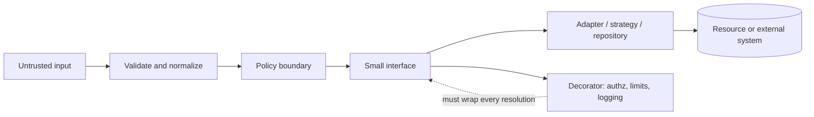

# Design Patterns

A pattern is useful only when it makes a boundary enforceable or removes coupling that is already
causing change. A class diagram is not evidence.

The failure this skill prevents is predictable: an assistant introduces interfaces, factories,
event buses, and singletons; authorization becomes distributed across callbacks; resources gain no
owner; nobody can say which object is safe to call.

## When to Use

- Two implementations must vary behind one stable policy-bearing interface
- An external or legacy API must be translated before domain code can use it
- Object construction has security invariants that callers currently repeat or bypass
- Cross-cutting behavior must wrap every call at a named boundary
- A publisher genuinely needs several independent consumers
- A data-access boundary must make tenant scope mandatory
- Reviewing an existing pattern for hidden coupling, bypasses, or lifetime leaks

Do not start from a pattern name. Start from the dependency or boundary that must change.

## Decision Table

| Need | Candidate | Boundary created | Cost and principal hazard |
|---|---|---|---|
| Choose one algorithm by trusted policy | Strategy | Caller cannot invoke concrete implementation directly | Dispatch and more types; unsafe registry selection enables A05/A06 |
| Translate an external contract | Adapter | External types and failures stop at one module | Mapping and exception translation; permissive defaults hide failure |
| Enforce construction invariants | Factory | Invalid or unscoped instances cannot be constructed | Central construction path; factory can become a service locator |
| Apply a control to every call | Decorator | Authorization, audit, or timeout wraps a narrow interface | Call depth and duplicate wrapping; alternate resolution can bypass it |
| Notify independent consumers | Observer | Publisher knows contracts, not consumers | Delivery ordering and cleanup; listener leaks, CWE-401/772 |
| Hide subsystem choreography | Facade | One supported entry into a subsystem | Broad facade becomes a god object; public internals preserve bypasses |
| Scope persistence operations | Repository | Domain cannot issue arbitrary storage operations | Extra mapping and possible N+1; generic CRUD erases authorization intent |
| Share immutable process service | Singleton / process scope | One owner for stateless or immutable resource | Global coupling; request-data capture causes cross-user exposure |
| Reuse expensive objects | Object pool | Acquisition and release become explicit | Contamination, missing release, and wait-queue growth, CWE-770/772 |

Composite, proxy, command, state, visitor, mediator, and template method are not default
recommendations. Apply the same test: name the real boundary or coupling they remove, and account
for lifetime and bypass paths.

## Boundary Model

The pattern earns its place only when code outside the boundary cannot bypass validation, policy,
or cleanup. A public concrete class beside its interface is not a boundary.

## Workflow

### 1. State the pressure

Write one sentence: "X changes independently of Y" or "callers can bypass control Z." If the
sentence is hypothetical, do not add a pattern.

### 2. Map all entry points

Search controllers, jobs, tests, scripts, dependency injection registrations, direct constructors,
and reflection or registry lookups. A control on one path does not secure another. This is the
primary `A01:2025` and ASVS V8 check.

### 3. Pick the smallest mechanism

A function parameter may replace Strategy. A function may replace Factory. `try/finally` may
replace a pool wrapper. One explicit call may replace Observer. Prefer the mechanism with fewer
bypass paths and fewer retained objects.

### 4. Make the boundary narrow and closed

Use intent-named operations and declared DTOs. Reject unknown discriminator values. Derive actor
and tenant from authenticated context, not payload fields. Parameterize data operations. These
controls address `A01:2025`, `A05:2025`, `A06:2025`, ASVS V8 and V15.

### 5. Assign resource ownership

For each singleton, listener, cache, pool lease, timer, and queued item, name its owner, maximum
lifetime, release point, and saturation behavior. Check success, exception, cancellation, timeout,
and shutdown. Use `skills/architecture/performance/` for detailed diagnosis.

### 6. Test the negative path

Prove an unregistered strategy is rejected, an undecorated implementation cannot be resolved, a
cross-tenant repository call is unrepresentable, unsubscribe runs, and a pool lease returns after
an exception. Log failures without suppressing them: `A10:2025`, ASVS V16.

### 7. Report cost and residual gap

For every recommendation state extra types, calls, allocations, queries, retained references, and
runtime state. Mark deployment assumptions and third-party behavior as unverified from source.

## When NOT to Use This

- One implementation exists and no verified second variation is planned. Use a function or class.
- The only benefit is folders named `factories`, `strategies`, or `observers`.
- A switch has three stable cases in one place. A switch is often clearer than a registry.
- Call order is business logic. Keep it explicit rather than hiding it behind observers or middleware.
- A transaction spans the operations. An async observer is not a transaction coordinator.
- The pattern exposes both abstraction and implementation, so callers can still bypass the boundary.
- A singleton would hold actor, tenant, request, response, transaction, or mutable authorization data.
- A cache or pool has no defensible capacity, eviction, acquire timeout, or full-queue policy.
- The team cannot name where authorization is enforced today. Add indirection only after that is clear.
- Tests become dominated by mocks for one-line wrappers. The abstraction is charging more than it buys.

## Security Mapping

- `A01:2025` / ASVS V8: bypassable decorators, unscoped repositories, singleton request state
- `A05:2025` / ASVS V15: dynamic SQL or command construction inside adapters and repositories
- `A06:2025` / ASVS V15: absent boundary, caller-selected implementations, unbounded registries
- `A10:2025` / ASVS V16: swallowed callback failures and resources not released on exceptions
- `CWE-602`: trusting client-side pattern or strategy selection as enforcement
- `CWE-653`: compartments exist in names but public implementations allow bypass
- `CWE-1220`: interfaces grant broader operations than the caller needs
- `CWE-401`, `CWE-770`, `CWE-772`: retained listeners/state, missing bounds, missing release

## Supporting Files

- [README.md](README.md) — purpose, layout, limitations, and references
- [checklist.md](checklist.md) — actionable pre-return verification
- [best-practices.md](best-practices.md) — boundary patterns with runnable code
- [common-mistakes.md](common-mistakes.md) — failures, fixes, and why fixes hold
- [troubleshooting.md](troubleshooting.md) — conflicts and pattern-removal paths
- [prompts.md](prompts.md) — prompts that produce structural findings
- [references/](references/) — concise, date-verified sources and mappings
- [examples/](examples/) — vulnerable/fixed TypeScript and Python pairs
