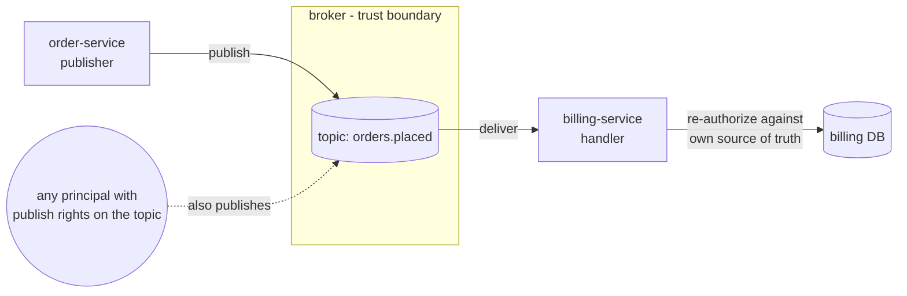
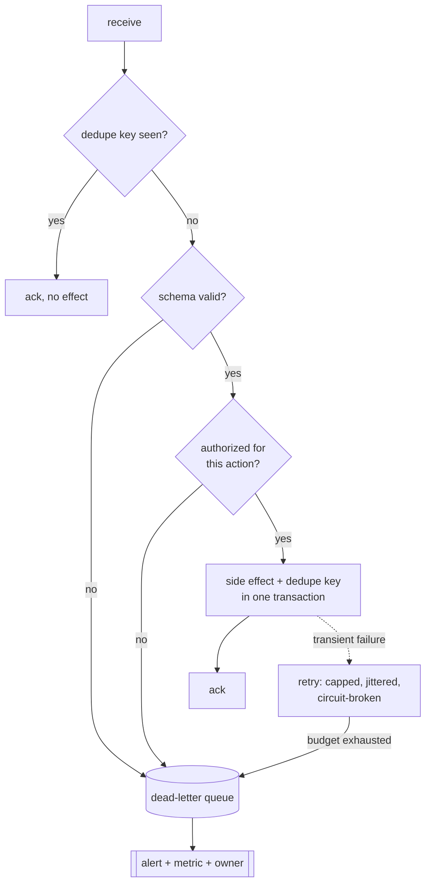

# Event-Driven Architecture

A consumer that acts on a message because "it came from our own queue" has no
authorization. The broker is a network boundary, not a membrane of trust. Anyone who can
publish to the topic can claim to be any producer, assert any `userId`, and hand the
consumer any `role` it will read.

That is the spine of this skill. Everything else follows from it: what a message may
carry, how it is parsed, how many times it may be applied, and what happens when it
cannot be applied at all.

The dotted arrow is the whole problem. The handler cannot tell the two publishers apart
from the payload, so the payload cannot be the basis of an access decision.

## When to Use

- Designing an event contract, a topic layout, or a consumer group
- Reviewing a message handler, a publisher, or a subscription registration
- A handler double-charged, double-sent, or double-granted after a redelivery
- Messages are disappearing, or a partition has stopped moving
- A consumer's memory grows with uptime rather than with load
- Choosing retry, prefetch, queue-depth, or DLQ settings
- Deciding whether a call should be an event at all

## Nine Hazards

Labels are used consistently across the supporting files.

| # | Hazard | Signal | Standard |
|---|---|---|---|
| E1 | Consumer trusts the payload's identity | Handler reads `userId`, `role`, `tenantId` and acts on it | A01, CWE-863, CWE-290 |
| E2 | Fat event carrying data the subscriber may not see | Full entity serialised into the message, then logged | A04, A09, CWE-359 |
| E3 | Polymorphic or type-embedded deserialization | Type name in the payload chooses the class | A08, CWE-502 |
| E4 | Non-idempotent handler | No dedupe key; redelivery repeats the side effect | A06, CWE-799 |
| E5 | Assumed ordering | Handler applies state without a version guard | A06, CWE-841 |
| E6 | Poison message, DLQ without alerting | A partition stalls, or the DLQ silently fills | A10, A09 |
| E7 | Schema change breaking a consumer | Producer adds a required field; consumers drop or crash | A08, A10 |
| E8 | One shared broker credential, no topic authz, no TLS | Same username in every service's config | A02, A07, CWE-522 |
| E9 | Subscription and queue lifecycle | Handlers never unsubscribed, unbounded queues, uncapped retries | A06, CWE-401, CWE-770 |

Fixes and code: [best-practices.md](best-practices.md).

## Workflow

### 1. Draw the boundary before writing the handler

For each topic, name who can publish and who can subscribe. If the answer is "everything
in the cluster", you do not have a boundary, you have a shared bus with a naming
convention. Broker-level topic authorization is the control (E8), and it is configuration,
not code.

### 2. Decide what the event may contain

Default to a thin event: entity ID, event type, occurred-at, and a version. The consumer
fetches what it is allowed to see. That removes E2 and re-applies authorization for free.
Name its cost: one extra call per event, and a race if the entity changed between publish
and fetch. See [best-practices.md](best-practices.md#e2--thin-events).

### 3. Re-authorize in the consumer

Look the actor up in the consumer's own source of truth, or call the owning service.
Never branch on a role that arrived in the message. Signing the event proves it came from
the producer - it does not prove the producer was allowed to ask for this.

### 4. Parse, do not deserialize

An explicit schema per event type. No type discriminator that selects a class, no
`pickle`, no `activateDefaultTyping`. Unknown fields are ignored or rejected by policy,
never used to construct something.

### 5. Make the handler safe to run twice

Delivery is at-least-once. Write the dedupe key and the side effect in one transaction,
and give the dedupe store a TTL longer than the maximum possible redelivery window. A
comment saying "make this idempotent" is not idempotency.

### 6. Decide the failure path per class of failure

Permanent failures go straight to the DLQ. Transient failures retry with a cap. A DLQ
with no alert is a data-loss channel that reports success (E6, A09).

### 7. Bound every resource the subscription owns

Subscription registration paired with teardown, bounded internal queues, explicit
prefetch, capped retries, TTL on the dedupe store. See
[best-practices.md](best-practices.md#e9--subscription-and-resource-lifecycle) and
`skills/architecture/performance/` for heap-level diagnosis.

### 8. Report

Per finding: hazard label, location, what an attacker or a redelivery can cause, the fix,
and the residual gap. "Add validation" is not a fix; "parse with an explicit schema and
re-fetch the order scoped to the actor" is.

## Severity

Rank by what an unauthenticated or low-privileged publisher can achieve, not by how bad
the pattern looks.

- **Critical** - a publisher with topic access causes a privileged action or reads another
  tenant's data (E1, E2). Or a payload reaches a polymorphic deserializer (E3).
- **High** - redelivery causes a money or grant duplication (E4). Or a DLQ with no
  alerting on a path that carries financial or audit events (E6).
- **Medium** - ordering assumption that corrupts state under normal broker behaviour
  (E5). Schema break that fails closed and is noisy (E7).
- **Low** - an unbounded structure that only grows under operator action, or a missing
  limit that another layer happens to bound.

E9 items are graded by whether a caller can drive the growth. A subscription leak in a
long-lived worker is high; the same leak in a short-lived job is a code smell.

## When NOT to Use This

Most systems that adopt an event bus did not need one. The honest cases against it:

- A call that must succeed before you respond is not an event. Async does not make a
  dependency optional, it makes the failure invisible. If the user cannot be told "saved"
  until the inventory reservation holds, reserve inventory synchronously.
- You need a result. Request/reply over a broker is an RPC with worse tooling, no stack
  trace, and a correlation ID you now have to debug.
- Strong ordering across entities is a requirement. Per-key ordering is achievable;
  global ordering across a partitioned topic is not, and pretending otherwise ships E5.
- Two services always deploy together and always change together. That is one service
  with a message broker in the middle for ceremony.
- The team cannot yet answer "where did this message go". An event bus without tracing,
  DLQ dashboards, and replay tooling converts bugs into silence.
- Fewer than a handful of consumers and no fan-out need. A direct call, or a transactional
  outbox drained by one worker, is simpler and easier to authorize.

An event earns its cost when the producer genuinely does not care who acts on the fact,
when consumers are added without changing the producer, and when the work can complete
minutes later without anyone being lied to.

## Related Skills

- `owasp-security` - the standards map cited here
- `api-security` - the synchronous surface the consumer calls back into
- `performance` - heap and goroutine-level detail for E9 leaks
- `scalability` - load shedding, partition sizing, consumer autoscaling
- `secure-architecture` - trust zones and threat modelling across services
- `redis-security` - Redis/Valkey ACLs, TLS, key/channel namespaces, Streams/Pub/Sub retention, and broker service boundaries

## Supporting Files

- [README.md](README.md) - purpose, standards table, limitations
- [checklist.md](checklist.md) - pre-return verification, grouped by hazard
- [best-practices.md](best-practices.md) - the nine hazards with real code
- [common-mistakes.md](common-mistakes.md) - including the wrong fixes
- [troubleshooting.md](troubleshooting.md) - when the pattern does not fit
- [prompts.md](prompts.md) - prompts that produce structure
- [references/](references/) - standards and broker docs, date-verified
- [examples/](examples/) - eight before/after pairs
