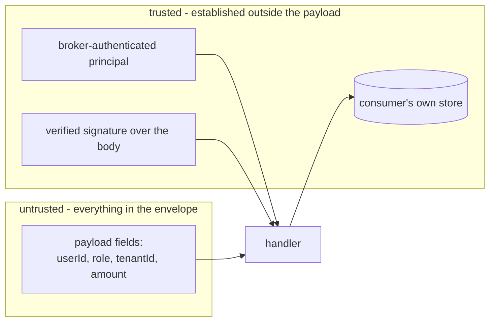

# Event-Driven Best Practices

Nine hazards, each with the failure first, then code that removes it. Every pattern names its
security implication and its runtime cost. A pattern with no cost note is incomplete - a broker
between two services buys decoupling and charges in queue depth, duplicate side effects, and
operational surface.

Languages: TypeScript for handlers and in-process buses, Python for consumers and sagas, Java for
Kafka configuration and serialization. The mistake is not language specific.

## The Rule Everything Else Serves

The message body is input from the network. It has exactly the trust level of an HTTP request body
from an unauthenticated caller, and less context, because there is no session attached to it.



Signing moves a message from untrusted to authenticated. It does not make it authorized. An
authenticated producer can still ask for something it may not have.

## E1 - Re-Authorize in the Consumer

```typescript
// Vulnerable: src/consumers/refund-issued.ts
// The role arrives in the message. Anyone with publish rights on the topic is an admin.
export async function onRefundApproved(msg: RefundApproved): Promise<void> {
  if (msg.approverRole === "finance_admin") {
    await ledger.credit(msg.accountId, msg.amountCents);
  }
}
```

`A01:2025`, `CWE-863`, `CWE-602`. The producer made the access decision and the consumer accepted
it. Authorization has left the request path and now lives on a message that no one authenticated.

```typescript
// Fixed: identity is re-resolved, the entitlement is re-checked, the load is scoped
import { z } from "zod";

const RefundApproved = z
  .object({
    eventId: z.string().uuid(),
    schemaVersion: z.literal(1),
    refundId: z.string().uuid(),
    approverId: z.string().uuid(),
    occurredAt: z.string().datetime(),
  })
  .strict();

export async function onRefundApproved(raw: unknown, env: Envelope): Promise<void> {
  // env.principal comes from the broker's authenticated connection, not from the body.
  if (!ALLOWED_PRODUCERS.has(env.principal)) throw new PermanentFailure("producer not allowed");

  const msg = RefundApproved.parse(raw);

  // Source of truth for who the approver is and what they may do.
  const approver = await users.findActive(msg.approverId);
  if (!approver) throw new PermanentFailure("unknown approver");
  if (!approver.can("refund:approve")) throw new PermanentFailure("approver not entitled");

  // Scoped load: a refund in another tenant is not found, not forbidden.
  const refund = await refunds.findForTenant(approver.tenantId, msg.refundId);
  if (!refund) throw new PermanentFailure("refund not visible to approver");

  await ledger.credit(refund.accountId, refund.amountCents, { dedupeKey: msg.eventId });
}
```

Security: the decision is made from state the consumer owns. A forged message with
`approverId` set to a real admin still fails, because the refund load is scoped and the amount
comes from the consumer's own record rather than the payload.

Cost: two extra reads per event. At 500 events/s that is 1000 reads/s against the user store and
the refund store. Cache the entitlement lookup with a short TTL if it hurts, and state the TTL as
the window in which a revoked permission still works. Do not cache the entity load.

The permission check being 60 seconds stale is a real gap. Say so rather than pretending the cache
is free.

## E2 - Thin Events

```python
# Vulnerable: producer serialises the whole row because "consumers might need it"
publish("customer.updated", {
    "id": str(c.id), "email": c.email, "phone": c.phone,
    "national_id": c.national_id, "internal_risk_score": c.risk_score,
    "notes": c.support_notes,
})
```

`A04:2025`, `CWE-359`. Three failures at once. The analytics consumer that subscribes next month
gets `national_id` for free. The topic retains it for the configured retention, far longer than the
request that produced it. A replay re-emits every field to every consumer that has since joined.

```python
# Fixed: the event states the fact; the consumer fetches what it is entitled to see
publish("customer.updated", {
    "event_id": str(uuid4()),
    "schema_version": 1,
    "customer_id": str(c.id),
    "changed": ["email", "phone"],   # field names, not values
    "occurred_at": now_iso(),
})
```

The consumer calls the customer service with its own credential, and that call applies its own
authorization. Adding a consumer no longer widens exposure by default.

Security: the topic stops being a data store. Retention and replay no longer decide how long
personal data lives on a broker. `ASVS V8`, `ASVS V14`.

Cost: one HTTP or database call per event, which turns a 10k/s topic into 10k/s of extra load on
the owning service and couples the consumer to its availability. It also introduces a race - by
the time the consumer fetches, the entity may have changed again, so the consumer sees a newer
state than the event describes. For a projection that is usually fine. For an audit record of what
was true at the time, it is not, and then you need a fat event with field-level justification and
tight retention.

Middle ground worth naming: a claim-check. Put the payload in object storage with an
authorization-checked read, and put the reference in the event. Cost is one more store and one more
lifecycle to expire.

## E3 - Parse, Do Not Deserialize

```java
// Vulnerable: type information in the payload chooses the class to construct.
ObjectMapper mapper = new ObjectMapper();
mapper.activateDefaultTyping(
        LaissezFaireSubTypeValidator.instance, ObjectMapper.DefaultTyping.NON_FINAL);
OrderEvent event = mapper.readValue(record.value(), OrderEvent.class);
```

`A08:2025`, `CWE-502`. The payload now selects a constructor. With a reachable gadget on the
classpath this is remote code execution in a background worker that usually has broader network
access than the web tier.

```java
// Fixed: closed schema, no polymorphism, explicit failure on unknown fields.
public record OrderPlaced(
        UUID eventId, int schemaVersion, UUID orderId, UUID buyerId, String occurredAt) {}

private static final ObjectMapper MAPPER = JsonMapper.builder()
        .enable(DeserializationFeature.FAIL_ON_UNKNOWN_PROPERTIES)
        .disable(MapperFeature.ALLOW_FINAL_FIELDS_AS_MUTATORS)
        .build();

OrderPlaced parse(byte[] body) throws PermanentFailure {
    if (body.length > MAX_EVENT_BYTES) throw new PermanentFailure("event too large");
    try {
        OrderPlaced e = MAPPER.readValue(body, OrderPlaced.class);
        if (e.schemaVersion() != 1) throw new PermanentFailure("unsupported schema version");
        return e;
    } catch (JacksonException ex) {
        throw new PermanentFailure("unparseable event");   // message only, never the body
    }
}
```

Python equivalent: never `pickle.loads` a message body, and use `yaml.safe_load` if the format is
YAML. `pickle` executes during load; there is no safe mode.

Security: the set of constructible types is fixed at compile time. Size is bounded before parsing,
so a large body cannot be an allocation lever (`CWE-770`).

Cost: an explicit record per event version, and an upcaster when a version is retired. That is
maintenance, and it is cheaper than the alternative.

## E4 - Idempotency in One Transaction

At-least-once is the delivery guarantee of every broker in common use. A consumer that dies after
the side effect but before the ack will see the message again.

```typescript
// Vulnerable: check-then-act. Two consumers, or one redelivery under concurrency, both charge.
const seen = await db.query("SELECT 1 FROM processed WHERE event_id = $1", [msg.eventId]);
if (seen.rowCount === 0) {
  await chargeCard(msg.orderId, msg.amountCents);
  await db.query("INSERT INTO processed (event_id) VALUES ($1)", [msg.eventId]);
}
```

`A08:2025`, `CWE-799`. The window between the `SELECT` and the `INSERT` is where the second charge
happens.

```sql
CREATE TABLE processed_event (
    consumer_group text        NOT NULL,
    event_id       uuid        NOT NULL,
    processed_at   timestamptz NOT NULL DEFAULT now(),
    PRIMARY KEY (consumer_group, event_id)
);
CREATE INDEX processed_event_processed_at_idx ON processed_event (processed_at);
```

```typescript
// Fixed: the unique constraint is the control. Claim and effect commit together.
await withTransaction(async (tx) => {
  try {
    await tx.query(
      "INSERT INTO processed_event (consumer_group, event_id) VALUES ($1, $2)",
      ["billing", msg.eventId],
    );
  } catch (e) {
    if (isUniqueViolation(e)) return;   // already applied; ack and move on
    throw e;
  }
  await recordChargeIntent(tx, msg.orderId, msg.amountCents, msg.eventId);
});

// The external call happens after commit, keyed by the same id, so it is also safe to repeat.
await psp.charge({ idempotencyKey: msg.eventId, orderId: msg.orderId });
```

Security: a duplicate delivery cannot duplicate money, a grant, or an invite. `ASVS V2`.

Cost: one row per event, forever, unless you delete it. That is the leak. Give it a TTL longer
than the maximum redelivery window - for SQS, message retention is configurable up to 14 days, so a
window shorter than the configured retention is wrong. Verify the number against your own broker
configuration rather than copying one.

```sql
-- Runs on a schedule. Without this the table is an unbounded store (CWE-401, CWE-770).
DELETE FROM processed_event WHERE processed_at < now() - interval '30 days';
```

If the dedupe key is user-controlled - a client-supplied request ID forwarded into the event - a
caller can insert rows at will. Cap rows per tenant, or derive the key from server-side values.
That variant is both a leak and an attacker-driven exhaustion vector.

## E5 - Ordering and Version Guards

Per-key ordering is achievable by partitioning on the entity ID. Global ordering across a
partitioned topic is not. A handler that assumes arrival order corrupts state the first time a
retry reorders two messages.

```python
# Fixed: the update is conditional on the version, so an older event cannot overwrite a newer one.
await conn.execute(
    """
    UPDATE order_summary
       SET status = $1, source_version = $2, updated_at = now()
     WHERE order_id = $3 AND source_version < $2
    """,
    event.status, event.version, event.order_id,
)
# Zero rows updated means a stale or duplicate event. Ack it; do not retry.
```

Security: state that drives later authorization decisions cannot be rolled back by a replayed
event. `CWE-841`.

Cost: every event needs a monotonic version from the producer, which usually means the producer
keeps a sequence per entity. Partitioning by entity ID caps parallelism at the partition count for
a hot entity, and a single hot key becomes a throughput ceiling you cannot scale past by adding
consumers.

## E6 - Failure Classes, Retry Budgets, and the DLQ

Two failure classes, two paths. Retrying a permanent failure is a hot loop; DLQ-ing a transient one
is data loss dressed as caution.

```python
# Fixed: classify, cap, jitter, then dead-letter with context but not with the payload.
MAX_ATTEMPTS = 5

async def handle(msg, attempt: int) -> None:
    try:
        await process(msg)
    except PermanentFailure as e:
        await dead_letter(msg, reason=str(e), attempt=attempt)   # no retry
    except TransientFailure as e:
        if attempt >= MAX_ATTEMPTS:
            await dead_letter(msg, reason=f"budget exhausted: {e}", attempt=attempt)
            return
        delay = min(2 ** attempt, 60) * (0.5 + random.random() / 2)   # cap + jitter
        await requeue(msg, delay_seconds=delay, attempt=attempt + 1)

async def dead_letter(msg, *, reason: str, attempt: int) -> None:
    # Identifiers and error only. The body may hold a token or personal data (CWE-532).
    log.error(
        "dead-lettered",
        extra={"event_id": msg.event_id, "type": msg.type, "attempt": attempt,
               "reason": reason},
    )
    metrics.increment("dlq.messages", tags=[f"type:{msg.type}"])
    await dlq.send(msg.raw)
```

RabbitMQ quorum queues do part of this for you: `x-delivery-limit` defaults to 20 since RabbitMQ
4.0, and once exceeded the message is dropped or dead-lettered if a dead-letter exchange is
configured. Setting it to `-1` disables the limit, which the RabbitMQ documentation explicitly
discourages. Configure a dead-letter exchange for every quorum queue.

Security: a DLQ with no alert is a silent data-loss channel that reports success - `A09:2025`,
`A10:2025`. Logging the whole payload on failure is how tokens and personal data reach a log
aggregator with wider read access than the database ever had - `CWE-532`.

Cost: the DLQ is a queue that nobody drains by default. Set retention, alert on depth, and name an
owner. Retry with a cap and jitter costs latency on the unhappy path; retry with no cap costs the
failing dependency its recovery window.

## E7 - Additive Schema Change

```java
// Vulnerable as a change: a new required field. Old consumers fail or silently read null.
public record OrderPlaced(UUID eventId, UUID orderId, UUID buyerId, String currency) {}
```

`A08:2025`. If `currency` is absent, an old consumer that defaults it to `USD` prices the order
wrong. If it throws, every in-flight message goes to the DLQ.

The rule: add optional fields, never rename or retype. When the shape must change, publish a new
event version alongside the old one, migrate consumers, then retire the old version.

```java
// Fixed: version in the envelope, consumer branches, producer dual-publishes during migration.
switch (envelope.schemaVersion()) {
    case 1 -> handleV1(MAPPER.readValue(body, OrderPlacedV1.class));
    case 2 -> handleV2(MAPPER.readValue(body, OrderPlacedV2.class));
    default -> throw new PermanentFailure("unsupported schema version");
}
```

Security: failing closed on an unknown version prevents a consumer from acting on a message it does
not fully understand. Silently ignoring unknown fields is a choice with a consequence - a field
added to carry a restriction is ignored by every consumer deployed before it.

Cost: dual publishing doubles topic volume for the migration window, and every version kept alive
is a handler kept alive. Retire versions on a schedule, or the switch grows without limit.

## E8 - Broker Authorization and Transport

This is configuration, not code, and it is the control that makes the trust boundary real.

For Kafka, the Confluent authorization documentation states that by default a resource with no
associated ACLs is accessible only to super users, and that
`allow.everyone.if.no.acl.found=true` reverses that. Deny rules take precedence over allow rules.
Producers need `Write` on the topic; consumers need `Read` on the topic and `Read` on the group.
`Describe` is implied by `Read`, `Write`, or `Delete`, so granting it separately is redundant.

```properties
# Per-service principal, TLS, no shared cluster credential.
bootstrap.servers=broker.internal.example:9093
security.protocol=SASL_SSL
sasl.mechanism=SCRAM-SHA-512
ssl.endpoint.identification.algorithm=https
sasl.jaas.config=org.apache.kafka.common.security.scram.ScramLoginModule required \
  username="svc-billing" password="${BILLING_BROKER_PASSWORD}";
```

Security: `A02:2025`, `A07:2025`, `ASVS V12`, `ASVS V15`. One shared credential means the blast
radius of any leaked config is every topic in the cluster - and it also destroys the only source of
producer identity the consumer had. `CWE-522`.

Cost: a principal, an ACL set, and a rotation path per service. Real operational work, and the
alternative is a bus where every service can impersonate every other.

Whether these settings are applied in the running cluster cannot be verified from application
source. Check the broker, or report it as unverified.

## E9 - Subscription and Resource Lifecycle

The classic in-process leak: subscribe on every request, unsubscribe never.

```typescript
// Vulnerable: one listener per request, retained forever. The closure retains req and res.
app.get("/orders/:id/stream", (req, res) => {
  bus.on("order.updated", (e) => {
    if (e.orderId === req.params.id) res.write(`data: ${JSON.stringify(e)}\n\n`);
  });
});
```

`CWE-401`. After a million requests the emitter holds a million closures, each retaining a request
and a response object. Node also warns at 11 listeners and then stops warning, so the signal
disappears early.

```typescript
// Fixed: registration paired with teardown on every exit path.
app.get("/orders/:id/stream", (req, res) => {
  const orderId = req.params.id;
  const onUpdate = (e: OrderUpdated) => {
    if (e.orderId === orderId) res.write(`data: ${JSON.stringify(e)}\n\n`);
  };
  bus.on("order.updated", onUpdate);

  const cleanup = () => {
    bus.off("order.updated", onUpdate);
    clearInterval(keepAlive);
  };
  const keepAlive = setInterval(() => res.write(": ping\n\n"), 30_000);

  res.on("close", cleanup);
  res.on("error", cleanup);
  req.on("aborted", cleanup);
});
```

Backpressure on an in-memory bus. The default is unbounded, which means the producer outruns the
consumer until the process is killed - `CWE-770` reaching `CWE-400`.

```python
# Fixed: bounded queue, explicit full behaviour, drop with a metric rather than grow.
queue: asyncio.Queue[Event] = asyncio.Queue(maxsize=1000)   # never Queue() with no maxsize

async def publish(event: Event) -> None:
    try:
        queue.put_nowait(event)
    except asyncio.QueueFull:
        metrics.increment("bus.dropped", tags=[f"type:{event.type}"])
        raise Backpressure("bus full")   # tell the caller; do not silently discard
```

Choose block, drop, or reject deliberately and write down which. Blocking propagates pressure to
the producer, which is usually correct and is also how a request timeout starts.

Saga and process-manager state:

```python
# Fixed: durable timeout, and deletion on every terminal path.
async def start_saga(order_id: str) -> None:
    await store.insert(saga_id=order_id, state="awaiting_payment",
                       expires_at=now() + timedelta(minutes=30))

async def sweep_expired() -> None:              # scheduled, not an in-process timer
    async for saga in store.find_expired(now(), limit=500):
        await compensate(saga)
        await store.delete(saga.saga_id)         # terminal: gone
```

An in-process `asyncio.sleep` or `setTimeout` timeout does not survive a restart, so the saga waits
forever and its row is never removed - `CWE-772`. A durable `expires_at` plus a sweeper does.

Consumer connection lifetime:

```python
# Vulnerable: a transaction held open across a network call. One slow vendor exhausts the pool.
async with pool.acquire() as conn:
    async with conn.transaction():
        await conn.execute("UPDATE ...")
        await http.post("https://vendor.example/notify", json=payload)   # holds the connection
```

Do the network call outside the transaction, keyed idempotently as in E4. Holding a pooled
connection across an await is how a consumer with prefetch 100 opens 100 database connections and
takes the web tier down with it.

Bounds to set explicitly, every time: prefetch or max-in-flight, internal queue size, retry cap,
DLQ retention, dedupe TTL, saga timeout, HTTP client timeout inside the handler. A missing timeout
on the last one turns every other bound into a formality.

For heap analysis, retained-size reading, and leak reproduction, use
`skills/architecture/performance/` - it owns that material. This section owns which structures in
an event-driven system are the ones that grow.

## Sources

- microservices.io, Transactional Outbox - <https://microservices.io/patterns/data/transactional-outbox.html>
- RabbitMQ quorum queues, delivery limit and dead lettering - <https://www.rabbitmq.com/docs/quorum-queues>
- Amazon SQS message quotas - <https://docs.aws.amazon.com/AWSSimpleQueueService/latest/SQSDeveloperGuide/quotas-messages.html>
- Confluent, Kafka authorization with ACLs - <https://docs.confluent.io/platform/current/security/authorization/acls/overview.html>
- Details and verification dates in [references/](references/).
