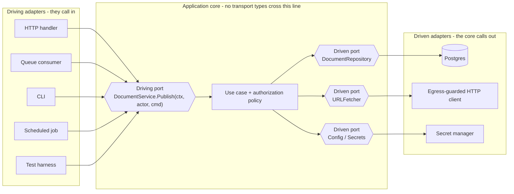

# Hexagonal Architecture (Ports and Adapters)

One sentence of theory, then the failure it prevents.

The core declares the interfaces it is called through and the interfaces it calls out
through. Everything that touches the outside world is an adapter on one side or the other.

The failure: `POST /documents/:id/publish` checks that the caller owns the document. Six
months later a queue consumer calls the same `publish()` function to handle a retry, and a
cron job calls it for scheduled publishing. Neither checks ownership, because the check was
never in the use case - it was in the HTTP handler. The authorization boundary was drawn
around one adapter instead of around the port. `A01:2025`, `CWE-602`, `CWE-653`.

Ports and adapters is worth its indirection when it makes that impossible. It is ceremony
when it does not.

## The Two Port Directions

Getting this backwards is the most common structural error. Both kinds of port are declared
by the core. They differ in who implements them.

| | Driving (primary) port | Driven (secondary) port |
|---|---|---|
| Declared by | The core | The core |
| Implemented by | The core | An adapter |
| Called by | A driving adapter | The core |
| Dependency arrow | Adapter => core | Adapter => core (inverted at runtime) |
| Examples | `DocumentService`, `PlaceOrder` | `DocumentRepository`, `URLFetcher`, `Clock`, `Config` |
| Adapters | HTTP handler, queue consumer, CLI, cron job, test harness | Postgres, S3, egress-guarded HTTP client, secret manager |
| Security role | The choke point where every actor is authorized | The choke point where outside data is made to conform |

A driven port that the core implements is not a port, it is a helper. A driving port whose
interface is written by the framework is not a port either - the arrow points the wrong way.

Every arrow crossing the `Core` box is a trust boundary. Count them: that is the number of
places validation and authorization can be enforced, and the number of places they can be
forgotten.

## When to Use

- A use case has, or will have, more than one way in - HTTP plus a queue, a CLI, a job
- Authorization or tenancy scoping must hold regardless of which entry point is used
- The core calls something you cannot run in a test: a payment provider, an SMTP server, a
  clock, a third-party API
- You need to test an abuse case, not just a happy path, and the real adapter cannot produce
  the abusive input
- An outbound call takes a user-influenced URL, hostname, or file path

## Workflow

### 1. List the actors, then the ports

Write down who drives the system and what the system drives. Each driving actor gets an
adapter, not a port - several actors share one port. If you have one port per adapter you
have renamed your controllers.

### 2. Put the identity in the port signature

Every driving port method takes the actor as a required parameter, not from ambient context.
No adapter can call the use case without supplying one, and the compiler enforces it. See
[best-practices.md](best-practices.md#driving-ports-take-the-actor).

### 3. Authorize inside the core, once

The use case decides. Adapters may reject earlier - an HTTP handler returning 401 for a
missing token is fine - but the decision that matters happens behind the port, where all
adapters meet. `A01:2025`, ASVS V8.

### 4. Make the adapter conform the outside world

Mapping belongs in the adapter, both directions. Inbound: parse the transport payload into a
core command, reject what does not fit. Outbound: validate the third-party response before it
becomes a domain object. A transport type in a core signature - `http.Request`, an ORM
entity, a broker message - ends the boundary. [best-practices.md](best-practices.md#mapping-belongs-in-the-adapter).

### 5. Bound the adapter's resources

Adapters own connections, clients, subscriptions, and timers. Create them once at composition
time, release them on shutdown, cap retries, and bound anything queued between a driving
adapter and the core. [best-practices.md](best-practices.md#adapter-resource-lifecycle).

### 6. Drive the port from a fake, including the abuse case

A fake driven adapter is the point of the pattern, not a side effect. Write the test where a
wrong actor calls the port and assert denial. [best-practices.md](best-practices.md#testing-the-abuse-case).

### 7. Report

Per finding: which port, which direction, which adapter, what an attacker reaches through the
adapter that skips the check, and the fix. Name the cost of any interface you add.

## Cost of Each Indirection

| Structure | Runtime cost | Naming it honestly |
|---|---|---|
| Port with one adapter, forever | An interface, a mock, one extra file to read | Not architecture. Delete the interface |
| Driven port per aggregate | N+1 loading when the port hides a join | See `skills/architecture/performance/` |
| Client created inside the adapter method | Socket and FD exhaustion under load | `CWE-772` |
| Client held forever, no idle timeout | Retained memory, half-open sockets, silent failure | `CWE-772` |
| Adapter subscription never released | Handler and closure retention across restarts | `CWE-401` |
| In-memory queue between adapter and core | Unbounded depth, no backpressure | `CWE-400`, see `skills/architecture/scalability/` |
| Uncapped retry in an adapter | Amplifies a dependency outage into an outage of your own | `CWE-400` |

## When NOT to Use This

Be blunt about this one. Most services that ask for hexagonal architecture do not need it.

- One entry point, one database, no third-party calls. You get `UserRepository` with exactly
  one implementation, a mock nobody needs, and two files to open before you can read one
  function. Use the framework's idioms and put the authorization check in the service call.
- A CRUD admin panel where the use case is the ORM call. There is no domain to protect.
- A single-purpose worker that reads one queue and writes one table. The port adds a hop.
- A prototype whose adapters will all be deleted. Interfaces freeze decisions you have not
  made yet.
- A team of one that will not write the fake adapter. The testability benefit is the payment
  for the indirection. Unpaid, it is just files.

The honest test: name the second adapter for the port. If you cannot, and it is not a
security boundary you are deliberately creating, do not add the port. A port that exists to
hold a security check is justified with one adapter - say that in a comment so the next
person does not "simplify" it away.

## How This Differs From Clean Architecture

They overlap enough that people use the words interchangeably. They are not the same shape.

- Hexagonal is symmetric about direction only. There is one core, and everything else is
  driving or driven. It does not prescribe how many layers live inside the core.
- Clean architecture prescribes concentric layers - entities, use cases, interface adapters,
  frameworks - plus the dependency rule that source dependencies point inward, and usually a
  model mapping at each layer boundary.
- Consequence for security: hexagonal makes you enumerate ports, so the trust boundaries are
  countable. Clean makes you enumerate layers, and authorization tends to smear across them
  because every layer looks like a plausible place for it.
- Consequence for cost: clean architecture's per-layer mapping allocates more objects per
  request and produces more files. Hexagonal's cost concentrates in the adapters.

Use hexagonal's port inventory to answer "where is authorization enforced". Use clean
architecture's layering if the core itself is large enough to need internal structure. The
sibling skill is `skills/architecture/clean-architecture/`.

## Related Skills

- `owasp-security` - the standards these findings cite
- `api-security` - controls for the HTTP driving adapter specifically
- `database-security` - what a repository adapter must not do
- `performance` - retained references, connection lifetime, unbounded caches
- `scalability` - backpressure once the queue between adapter and core is bounded

## Supporting Files

- [README.md](README.md) - purpose, layout, limitations, security notes
- [checklist.md](checklist.md) - pre-return verification
- [best-practices.md](best-practices.md) - patterns with Go, TypeScript, and Java code
- [common-mistakes.md](common-mistakes.md) - what goes wrong and why the fix holds
- [troubleshooting.md](troubleshooting.md) - when the pattern does not fit
- [prompts.md](prompts.md) - prompts that produce structure, plus an anti-pattern table
- [references/](references/) - sources with the date verified
- [examples/README.md](examples/README.md) - eight before/after pairs
