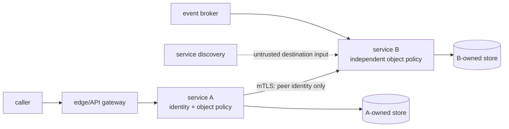

# Microservices Architecture

A service split that leaves one database, one credential, and one broad network allow-list is not a security boundary. It is a distributed monolith with more places to make an authorization mistake.

The useful question is not "how many services?" It is: what does each service own, which principal may perform each operation on each object, and what resource budget remains when replicas and retries multiply?

## When to use

- Splitting a deployable into independently owned services.
- Reviewing service-to-service calls, identity propagation, or object authorization.
- Deciding whether mTLS, a gateway, a service mesh, or discovery solves a stated problem.
- Inventorying HTTP, gRPC, queue, webhook, and admin APIs.
- Planning a strangler migration with rollback and data ownership.
- Diagnosing connection exhaustion, retry storms, fan-out latency, queue growth, or retained saga state.

## Boundary rules

1. Give every service a stable workload identity. Never infer identity from a payload, source IP, or service name string.
2. Enforce authorization in the service that owns the object, for every object and operation. A gateway check is not enough.
3. Treat mTLS as authenticated transport. It does not authorize `invoice-0002` for this caller.
4. Do not share a database as a shortcut. Shared tables erase ownership, bypass policy, and couple deploys.
5. Authenticate and authorize event producers and consumers independently. A signed event proves origin, not permission.
6. Treat discovery results and URLs as untrusted input. Pin schemes, resolve approved service identities, and block metadata/private destinations where applicable.
7. Maintain an API inventory: owner, audience, authn, object policy, data classification, rate limit, timeout, dependency fan-out, and deprecation date.

## Workflow

### 1. State the boundary and failure
Write the owned objects, commands, queries, events, callers, and data that must not cross. Lead with a failure: "gateway authorizes tenant A, but service B trusts a caller-supplied object ID." Map it to A01:2025 or A06:2025 and a verified CWE.

### 2. Inventory the surface
Search routes, RPC registrations, consumers, health/admin endpoints, discovery clients, outbound URL construction, database credentials, and shared schemas. Record undocumented endpoints as findings, not assumptions.

### 3. Choose identity and policy placement
Use workload identity for the calling service and end-user context separately. At the owner, load the object and evaluate `(subject, action, object, tenant, context)`. Reject missing or stale context. Do not let a gateway or mTLS peer substitute for object policy.

### 4. Model calls and costs
For each request, count connection pools per replica, sequential hops, parallel fan-out, retry attempts, trace spans, queue capacity, saga rows, circuit-breaker cardinality, and cache retention. Put hard limits on each.

### 5. Design failure semantics
Set deadlines, bounded retries with jitter, retry budgets, bulkheads, circuit-breaker state limits, idempotency keys, queue limits, and compensation expiry. State which errors are permanent and which are retryable.

### 6. Migrate in reversible slices
Introduce a contract and telemetry first. Shadow or dual-read where safe, then route a bounded percentage. Keep rollback ownership explicit. Do not dual-write two authoritative stores without reconciliation and a stop condition.

### 7. Verify and report
For every boundary, report location, attacker capability, impact, fix, cost, residual gap, and whether the live control was verified. Report observable limits: max hops, timeout, retries, pool size, queue depth, saga age, trace sampling, and metric/cache cardinality.

## Runtime cost ledger

| Structure | Cost to name and bound |
|---|---|
| Replica × outbound dependency | Connection pools, sockets, TLS handshakes, file descriptors |
| Retry × fan-out | Load amplification and tail latency; retries can storm together |
| Hop × request | Trace spans, context propagation, serialization, failure modes |
| Queue | Retained payload bytes, consumer lag, replay and DLQ storage |
| Saga | Durable state and sensitive context retained until expiry |
| Circuit breaker | State per destination and metric labels; unbounded keys leak memory |
| Cache | Retained authorization/data entries and stale revocations |

## When NOT to use this

- A small team cannot operate independent deploys, per-service alerts, and data ownership. Keep a modular monolith.
- The proposed split requires synchronous calls across nearly every request. The network adds latency and failure without decoupling.
- Services share tables, transactions, or a single release train. Extract a module first; do not call the seam a boundary.
- The workload has one scaling shape and no independent availability or compliance boundary.
- The only stated benefit is "cleaner folders" or "use mTLS." Neither is an architectural boundary.
- A distributed saga would retain sensitive context longer than a local transaction can, and no expiry or recovery owner exists.
- You cannot inventory or observe the APIs, dependencies, queues, and rollback path. Do not split what you cannot operate.

## Supporting files

- [README.md](README.md) - purpose, layout, configuration, limits, references.
- [best-practices.md](best-practices.md) - boundary, identity, authorization, discovery, and cost patterns with runnable code.
- [checklist.md](checklist.md) - actionable pre-return verification.
- [common-mistakes.md](common-mistakes.md) - failure, cause, fix, and why it works.
- [troubleshooting.md](troubleshooting.md) - conflicts, migration, rollback, and unverified runtime controls.
- [prompts.md](prompts.md) - scoped review prompts and anti-patterns.
- [references/](references/) - pinned standards and verified CWE entries.
- [examples/README.md](examples/README.md) - before/after code pairs.
