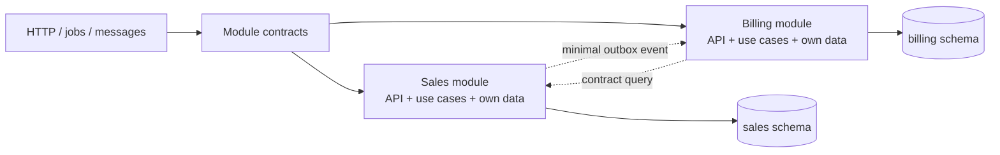

# Modular Monolith

A modular monolith is one deployable process with multiple modules that behave like separate
services at their seams. The deployable boundary is not the module boundary. A module is secure
only when code, data, and runtime contracts make bypasses difficult or impossible.

## When to Use

- Several business capabilities share a deployment and need local-call latency.
- Teams need ownership boundaries before accepting microservice operational cost.
- A transaction must cover state owned by one capability and its published facts.
- The application has multiple entry points and needs one actor-scoped authorization path.
- A monolith is growing shared tables, global services, or imports that bypass business rules.

## Core Workflow

1. Name modules by business capability, not technical layers.
2. For each module, list owned tables/schema, database role, public commands/queries, and events.
3. Make every public operation accept an explicit actor or system principal and a cancellation/deadline.
4. Put authorization and invariants inside the owning module. Controllers are adapters only.
5. Forbid imports of another module's persistence package and all cross-module table access.
6. Use local transactions only for one module's state plus its outbox rows. Call other modules by contract.
7. Make events minimal, versioned, idempotent, and post-commit. Re-authorize consequential consumers.
8. Bound listeners, queues, caches, batches, retries, and handles. Dispose every scoped resource.
9. Add module contract tests and architecture checks, then measure query count, latency, retention, and queue depth.

## Boundary Map

| Rule | Security boundary | Runtime cost |
|---|---|---|
| Module owns its tables and migrations | Prevents unauthorized reads, confused meanings, and CWE-653 improper compartmentalisation | More schemas/roles, migration coordination, and explicit projections |
| Public actor-scoped contract only | Centralizes A01 authorization and ASVS V8 checks | Small DTO/validation allocations and a call indirection |
| No cross-module table or ORM access | Removes caller-controlled tenant predicates and CWE-1220 insufficient granularity | Mapping or contract-query cost; fewer accidental joins |
| Local transaction plus outbox | Makes state/event integrity atomic; maps A06 and A10 | Outbox write, polling, retries, duplicate handling, storage retention |
| Dependency direction toward contracts/domain | Stops infrastructure and modules becoming a shared mutable implementation | More files and compile-time checks; less hidden coupling |
| Bounded queues/listeners/cache and scoped resources | Limits DoS and stale-actor disclosure; CWE-770/772 | Rejection, backpressure, eviction, and monitoring overhead |

## When NOT to Use This

Do not create modules, contracts, outboxes, or an internal bus for a two-endpoint CRUD feature with
no invariant beyond `WHERE tenant_id = ?`. A thin handler with a visible tenant predicate is easier
to audit and cheaper to run.

Do not use this structure when a single transaction must atomically update several capabilities and
there is no acceptable intermediate state or compensation. Keep the boundary around the invariant.

Do not use it for a short-lived script, a prototype with an expiry date, or a read-only report that
can project directly to a bounded DTO. Do not split merely because folders are large; split where
language, data ownership, authorization, or change ownership differs.

Do not use an in-process event bus as a durable workflow. If delivery, replay, ordering, or failure
recovery matters, use an outbox and an appropriate durable transport. A microservice split is not a
free fix: it adds network failures, serialization, deployment, observability, and distributed
transaction costs. Keep a modular monolith when local calls and one deploy are valuable, while
making its seams strong enough to extract later.

## File Index

- [README.md](README.md): purpose, layout, configuration, limitations, and security notes.
- [best-practices.md](best-practices.md): enforceable boundaries, contracts, transactions, outbox, and lifecycle cost.
- [common-mistakes.md](common-mistakes.md): bypasses, why they happen, and structural fixes.
- [troubleshooting.md](troubleshooting.md): legacy schemas, atomicity conflicts, slow handlers, and migration paths.
- [checklist.md](checklist.md): actionable pre-return verification.
- [prompts.md](prompts.md): prompts that force evidence and anti-patterns.
- [references/](references/): standards and weakness definitions, verified 2026-07-28.
- [examples/README.md](examples/README.md): runnable TypeScript, Java, and Python vulnerable/fixed pairs.
