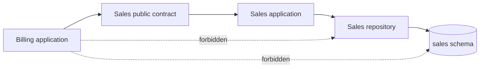

# Best Practices

Each recommendation names the boundary it creates, the runtime cost it adds, and the relevant
standard. A folder convention without enforcement is not a boundary.

## Own Code and Data Together

`A01:2025` · `A06:2025` · ASVS V8, V15 · `CWE-653`, `CWE-1220`

A module owns its domain types, use cases, migrations, tables, and write role. Other modules call
its public contract. They never import its repository or name its tables.



Enforce this with package visibility or separate build projects, architecture tests for imports,
and database grants. Search migrations and SQL for table names; do not infer ownership from folders.

Security boundary: the owner applies the same tenant and authorization rules for every caller.
Direct cross-module data access is improper compartmentalisation and weak granularity because a
caller can select or mutate state below the owner's policy.

Runtime cost: contract calls allocate DTOs and may replace a cheap join with multiple queries. For
read-heavy views, let the owner publish a minimal projection or expose a bounded query. Do not trade
that cost for an unowned join. Measure round trips and payload size.

## Actor-Scoped Module APIs

`A01:2025` · ASVS V8 · `CWE-602`, `CWE-1220`

The module that owns the consequence must authorize it. A route guard or caller check is not enough;
jobs and message handlers bypass HTTP.

```typescript
export type Actor = Readonly<{
  userId: string;
  tenantId: string;
  permissions: ReadonlySet<string>;
}>;

export type ApproveInvoice = Readonly<{ invoiceId: string }>;
export type Approval = Readonly<{ invoiceId: string; status: "approved" }>;

export interface BillingApi {
  approve(actor: Actor, command: ApproveInvoice, signal: AbortSignal): Promise<Approval>;
}

export class BillingModule implements BillingApi {
  constructor(private readonly invoices: InvoiceRepository) {}

  async approve(actor: Actor, command: ApproveInvoice, signal: AbortSignal): Promise<Approval> {
    if (!actor.permissions.has("invoice:approve")) throw new Error("forbidden");
    const invoice = await this.invoices.findForTenant(
      actor.tenantId, command.invoiceId, signal,
    );
    if (!invoice) throw new Error("not_found");
    invoice.approve(actor.userId);
    await this.invoices.save(invoice, signal);
    return Object.freeze({ invoiceId: command.invoiceId, status: "approved" });
  }
}
```

The actor is explicit, non-optional, and constructed at an authenticated edge. System jobs use an
explicit least-privilege system actor, not a bypass flag. IDs should be nominal/branded where
possible so tenant and resource IDs cannot be swapped.

Security boundary: callers cannot invoke a consequential operation without presenting identity,
and the owner checks that identity against the target row. This replaces client/caller enforcement
(CWE-602) with server-side enforcement.

Runtime cost: one small actor/command object and validation per call. Cache parsed permissions only
within the request scope. A process cache keyed only by user ID can cross tenants and retain stale
privileges.

## Contracts Are Narrow and Materialized

`A01:2025` · `A05:2025` · ASVS V8, V15 · `CWE-1220`

Export intention-revealing commands and queries. Reject unknown input fields. Return immutable,
allowlisted DTOs. Never export a generic repository, SQL fragment, ORM model, lazy relation, stream,
or cursor.

```java
public record Actor(String userId, String tenantId, Set<String> permissions) {
    public Actor { permissions = Set.copyOf(permissions); }
}
public record GetBalance(String accountId) {}
public record BalanceView(String accountId, long minorUnits, String currency) {}

public interface AccountsApi {
    Optional<BalanceView> getBalance(Actor actor, GetBalance query);
}
```

`find(Map criteria)` and `query()` let callers choose predicates and fields. That invites missing
tenant filters and injection when criteria become SQL. Materialization ensures database handles are
closed inside the owner instead of hidden behind an iterator.

Security boundary: the owner controls query shape, row scope, and response fields. Runtime cost:
materialization retains up to the result limit. Every collection contract therefore needs a maximum,
pagination, cancellation, and measured row/byte budget.

## Dependency Direction Is Compile-Time Policy

`A06:2025` · ASVS V15 · `CWE-653`

Module domain/application code may depend on its own public contracts and domain. Adapters and
infrastructure depend inward and implement ports. The composition root may know concrete modules,
but contains no business rule.

```text
composition -> sales.infrastructure -> sales.application -> sales.domain
billing.application -> sales.public
billing.application -X-> sales.infrastructure
sales.domain -X-> framework / ORM / billing
```

Use separate build units or package export maps. Add a CI architecture test that fails on forbidden
imports. A code-review rule alone fails silently.

Security boundary: ORM and private services cannot become an alternate policy path. Runtime cost:
interfaces and DTO mapping add navigation and allocation. Do not add an interface with one
implementation unless it pins a boundary, enables framework-free compilation, or has another real
consumer.

## One Module per Transaction

`A06:2025` · `A10:2025` · ASVS V15, V16 · `CWE-772`

A local transaction covers one module's state and its outbox rows. It does not stay open while
another module performs I/O or acquires its own locks.

```python
def place_order(actor: Actor, command: PlaceOrder) -> str:
    quote = pricing.quote(actor, command.items)  # call before transaction
    with sales_db.transaction() as tx:
        order = Order.place(actor.tenant_id, actor.user_id, command, quote)
        tx.orders.insert(order)
        tx.outbox.insert(OrderPlaced.from_order(order))
        tx.commit()
    return order.id
```

If a rule truly requires atomic writes to two modules, the proposed boundary is wrong or the
business must accept a visible pending state and compensation. Do not hide the problem with a
shared unit of work.

Security boundary: each owner controls writes and rollback. Runtime cost: shorter transactions
reduce lock and connection occupancy, but a pre-transaction quote can become stale. Carry a version
or expiry and reject/retry within a bounded budget. Never retry non-idempotent work blindly.

Holding a transaction across a module call can deadlock when the callee calls back or locks tables
in the opposite order. It also retains the connection, actor graph, and tracked entities for the
callee's duration. This is a handle-lifetime failure when cleanup is missed (`CWE-772`).

## Transactional Outbox

`A06:2025` · `A10:2025` · ASVS V15, V16

Writing state then publishing leaves a crash window. Publishing then committing lets consumers act
on rolled-back state. Write the business change and an immutable outbox row in the same transaction.
A worker publishes committed rows later.

```typescript
type OutboxMessage = Readonly<{
  id: string;
  tenantId: string;
  type: "OrderPlaced.v1";
  payload: Readonly<{ orderId: string; customerId: string }>;
  occurredAt: string;
}>;

await db.transaction(async (tx) => {
  await tx.orders.insert(orderRow);
  await tx.outbox.insert(message);
});
```

Consumers deduplicate by message ID and re-check local authority/state before consequential work.
The payload is a trigger, not a capability. Do not put full entities, secrets, or mutable objects in
it.

Security boundary: committed facts cannot be fabricated by a publish preceding rollback; consumers
own their authorization. Runtime cost: one extra write, serialization, polling, duplicate delivery,
index maintenance, and retained outbox rows. Bound poll batch and concurrency. Define poison-message
state, retry/time budget, lag metrics, and deletion/archive retention.

## Module Contract Tests

`A01:2025` · `A05:2025` · ASVS V8, V15, V16

Test a module through its public API with its real persistence adapter. Required cases:

- allowed actor succeeds; missing permission fails;
- actor from tenant A cannot read, update, or infer tenant B's resource;
- malformed/unknown fields and over-limit collections fail at the boundary;
- output contains only declared fields;
- rollback creates neither business state nor outbox row;
- duplicate event delivery has one effect;
- a runtime DB role cannot read or write another module's schema;
- public contract compatibility is checked against supported consumers.

Architecture tests inspect imports and migration/table ownership. They complement behavior tests:
compile-time direction cannot prove SQL scoping, and an integration test cannot prove no forbidden
import exists elsewhere.

Security boundary: tests make bypasses and contract drift visible. Runtime cost: database-backed
contract tests are slower and need isolated schemas. Keep a focused suite per module and run broader
cross-module flows separately.

## Resource Lifetimes Are Part of the Boundary

`A01:2025` · `A06:2025` · `A10:2025` · ASVS V8, V15, V16 · `CWE-770`, `CWE-772`

### Global event bus listeners

Register host-lifetime handlers once. If a shorter scope subscribes, `subscribe` must return a
disposer invoked on normal completion, error, cancellation, and shutdown. A global bus retains each
handler closure; per-request registration leaks actors, tenants, connections, and modules, then
executes old handlers repeatedly.

### Singleton module state

A module singleton must be stateless or hold only explicitly bounded, tenant-keyed process state.
Never store current actor, tenant, transaction, repository, ORM session, or request DTO in an
instance field. Pass actor and scope through calls. This is confidentiality first (A01) and memory
retention second.

### Queues and caches

Every in-process queue has a maximum depth and defined full behavior: block, reject, or drop only
explicitly disposable work. Every cache has a maximum entries/bytes, TTL/eviction, tenant-aware key,
and metrics. Missing bounds are CWE-770. The cost of a bound is saturation; that is safer than OOM.

### Lazy iterators and hidden handles

A module must not return an iterator backed by an open cursor, stream, transaction, or ORM session.
Materialize a bounded page inside the module or expose a callback/async scope whose owner is clear.
Garbage collection is not prompt release. Unclosed cursors and streams are CWE-772.

### Observability

Measure per module: request latency, query count, rows/bytes, open/acquire-waiting connections,
transaction duration, outbox lag/rows/retries, listener count, queue depth/rejections, and cache
entries/bytes/evictions. Do not put secrets or full actor objects in labels or logs.

## Modular Monolith versus Microservices

| Decision | Modular monolith | Microservices |
|---|---|---|
| Calls | Typed in-process; low latency, shared failure domain | Network protocol; partial failure, serialization, retries |
| Deployment | One release and rollback | Independent release, compatibility and orchestration cost |
| Data | Separate ownership can share one database server | Stronger physical isolation, harder cross-service consistency |
| Transactions | Easy within one module; cross-module still discouraged | Distributed transaction or eventual consistency |
| Resources | Shared heap/CPU/pool can allow noisy neighbors | Per-service limits, but more total pools and processes |
| Extraction | Strong contracts make later extraction feasible | Already separate, at permanent operational cost |

Choose microservices when independent scaling, deployment, regulatory isolation, technology/runtime,
or failure containment has measured value worth the network and operational cost. Do not choose them
to repair weak module discipline; a service that shares another service's database is the same hole
with extra latency.
